# Codenames50 Complete Technical Documentation

**Version:** 1.0  
**Date:** January 2025  
**Project:** Codenames50 - Real-time Multiplayer Board Game

---

## Table of Contents

1. [Project Overview](#project-overview)
2. [System Architecture](#system-architecture)
3. [Game Logic Deep Dive](#game-logic-deep-dive)
4. [Real-time Communication](#real-time-communication)
5. [Database Design](#database-design)
6. [Frontend Architecture](#frontend-architecture)
7. [Development Guide](#development-guide)
8. [Appendices](#appendices)

---

## Project Overview

### Introduction

Codenames50 is a TypeScript-based implementation of the popular Codenames board game, built as a real-time multiplayer web application. The project is structured as a monorepo using Yarn Workspaces and Lerna, containing a Node.js/Express server backend, React frontend, and shared game logic packages.

### Key Features

- **Real-time Multiplayer**: Up to 8 players per game with live synchronization
- **Cross-platform**: Web-based interface accessible on desktop and mobile
- **Multiple Languages**: Support for English and Portuguese word sets
- **Game Variants**: Standard Codenames and new Interception variant with scoring
- **Audio Feedback**: Contextual sound effects for game events including steal sounds
- **Enhanced UI**: Modern Material-UI v7 interface with improved game setup
- **Responsive Design**: Optimized for various screen sizes
- **Clean Architecture**: Modular design with clear separation of concerns

### Technology Stack

**Frontend:**
- React 18.3 with TypeScript 5.6
- Material-UI v7 for components and theming
- Socket.IO Client 4.7.5 for real-time communication
- React Router v6 for navigation
- Vite for build system and development server
- Vitest for testing
- Use-Sound for audio effects

**Backend:**
- Node.js 20+ with Express.js 4.17
- Socket.IO 4.7.5 for WebSocket server
- MongoDB 6.0 for data persistence
- TypeScript 5.6 with strict configuration
- FP-TS for functional programming patterns

**Development:**
- Lerna 8.1 for monorepo management
- Yarn Workspaces for dependency management
- Vitest for testing across all packages
- ESLint v9 + Prettier for code quality
- Vite for fast builds and hot module replacement

---

## System Architecture

### High-Level Overview

The system follows a client-server architecture with real-time communication:

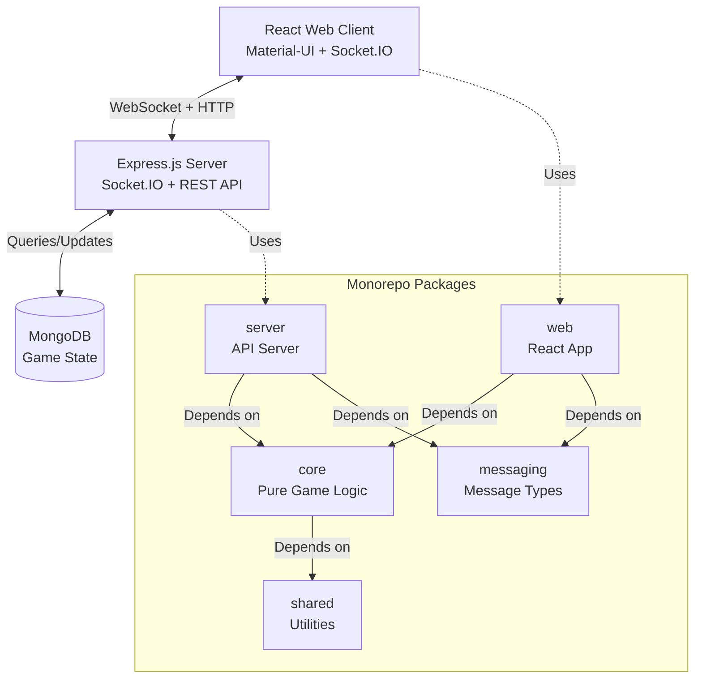
```mermaid
graph TB
    Client[React Web Client<br/>Material-UI + Socket.IO]
    Server[Express.js Server<br/>Socket.IO + REST API]
    DB[(MongoDB<br/>Game State)]
    
    Client <-->|WebSocket + HTTP| Server
    Server <-->|Queries/Updates| DB
    
    subgraph "Monorepo Packages"
        Core[core<br/>Pure Game Logic]
        Messaging[messaging<br/>Message Types]
        Shared[shared<br/>Utilities]
        WebPkg[web<br/>React App]
        ServerPkg[server<br/>API Server]
    end
    
    Client -.->|Uses| WebPkg
    Server -.->|Uses| ServerPkg
    ServerPkg -->|Depends on| Core
    ServerPkg -->|Depends on| Messaging
    WebPkg -->|Depends on| Core
    WebPkg -->|Depends on| Messaging
    Core -->|Depends on| Shared
```

### Package Dependencies

The monorepo is organized into five main packages with clear dependency relationships:

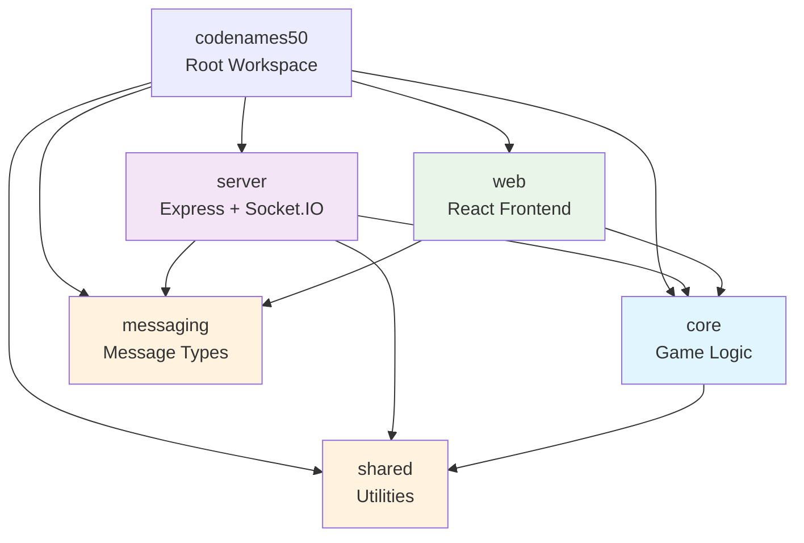
```mermaid
graph TD
    Root[codenames50<br/>Root Workspace]
    
    Root --> Core[core<br/>Game Logic]
    Root --> Messaging[messaging<br/>Message Types]
    Root --> Shared[shared<br/>Utilities]
    Root --> Server[server<br/>Express + Socket.IO]
    Root --> Web[web<br/>React Frontend]
    
    Server --> Core
    Server --> Messaging
    Server --> Shared
    
    Web --> Core
    Web --> Messaging
    
    Core --> Shared
    
    classDef corePackage fill:#e1f5fe
    classDef serverPackage fill:#f3e5f5
    classDef webPackage fill:#e8f5e8
    classDef utilPackage fill:#fff3e0
    
    class Core corePackage
    class Server serverPackage
    class Web webPackage
    class Messaging,Shared utilPackage
```

### Clean Architecture Layers

The application implements clean architecture principles with clear layer separation:

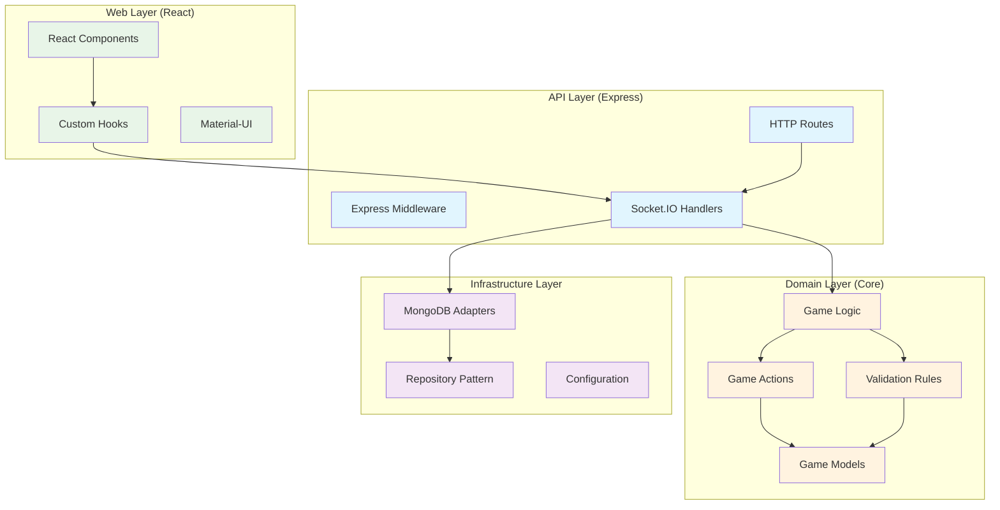
```mermaid
graph TB
    subgraph "Web Layer (React)"
        Components[React Components]
        Hooks[Custom Hooks]
        UI[Material-UI]
    end
    
    subgraph "API Layer (Express)"
        Routes[HTTP Routes]
        Middleware[Express Middleware]
        SocketHandlers[Socket.IO Handlers]
    end
    
    subgraph "Domain Layer (Core)"
        GameLogic[Game Logic]
        Actions[Game Actions]
        Rules[Validation Rules]
        Models[Game Models]
    end
    
    subgraph "Infrastructure Layer"
        Database[MongoDB Adapters]
        Repositories[Repository Pattern]
        Config[Configuration]
    end
    
    Components --> Hooks
    Hooks --> SocketHandlers
    Routes --> SocketHandlers
    SocketHandlers --> GameLogic
    GameLogic --> Actions
    GameLogic --> Rules
    Actions --> Models
    Rules --> Models
    SocketHandlers --> Database
    Database --> Repositories
    
    classDef webLayer fill:#e8f5e8
    classDef apiLayer fill:#e1f5fe
    classDef domainLayer fill:#fff3e0
    classDef infraLayer fill:#f3e5f5
    
    class Components,Hooks,UI webLayer
    class Routes,Middleware,SocketHandlers apiLayer
    class GameLogic,Actions,Rules,Models domainLayer
    class Database,Repositories,Config infraLayer
```

### Data Flow Architecture

The request/response flow demonstrates the system's reactive architecture:

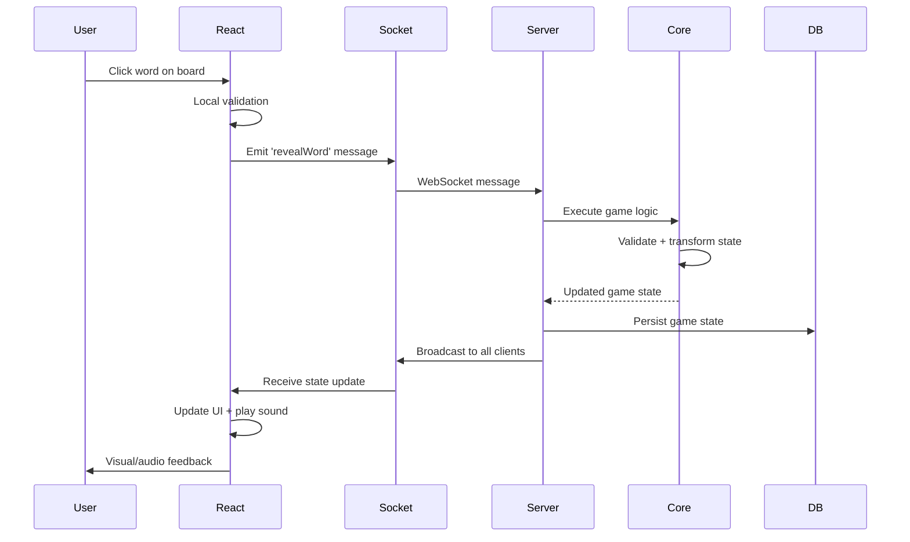
```mermaid
sequenceDiagram
    participant User
    participant React
    participant Socket
    participant Server
    participant Core
    participant DB
    
    User->>React: Click word on board
    React->>React: Local validation
    React->>Socket: Emit 'revealWord' message
    Socket->>Server: WebSocket message
    Server->>Core: Execute game logic
    Core->>Core: Validate + transform state
    Core-->>Server: Updated game state
    Server->>DB: Persist game state
    Server->>Socket: Broadcast to all clients
    Socket->>React: Receive state update
    React->>React: Update UI + play sound
    React->>User: Visual/audio feedback
```

---

## Game Logic Deep Dive

### Game State Machine

The Codenames game follows a well-defined state machine with clear transitions:

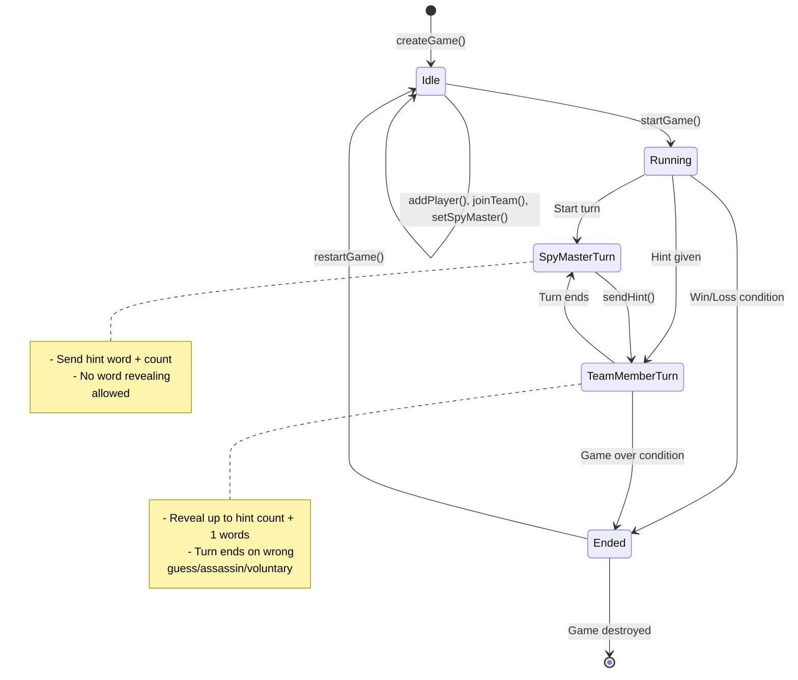
```mermaid
stateDiagram-v2
    [*] --> Idle: createGame()
    
    Idle --> Running: startGame()
    Idle --> Idle: addPlayer(), joinTeam(), setSpyMaster()
    
    Running --> SpyMasterTurn: Start turn
    Running --> TeamMemberTurn: Hint given
    Running --> Ended: Win/Loss condition
    
    SpyMasterTurn --> TeamMemberTurn: sendHint()
    TeamMemberTurn --> SpyMasterTurn: Turn ends
    TeamMemberTurn --> Ended: Game over condition
    
    Ended --> Idle: restartGame()
    Ended --> [*]: Game destroyed
    
    note right of SpyMasterTurn
        - Send hint word + count
        - No word revealing allowed
    end note
    
    note right of TeamMemberTurn
        - Reveal up to hint count + 1 words
        - Turn ends on wrong guess/assassin/voluntary
    end note
```

### Core Game Models

The game data structure is built around a central `CodeNamesGame` entity:

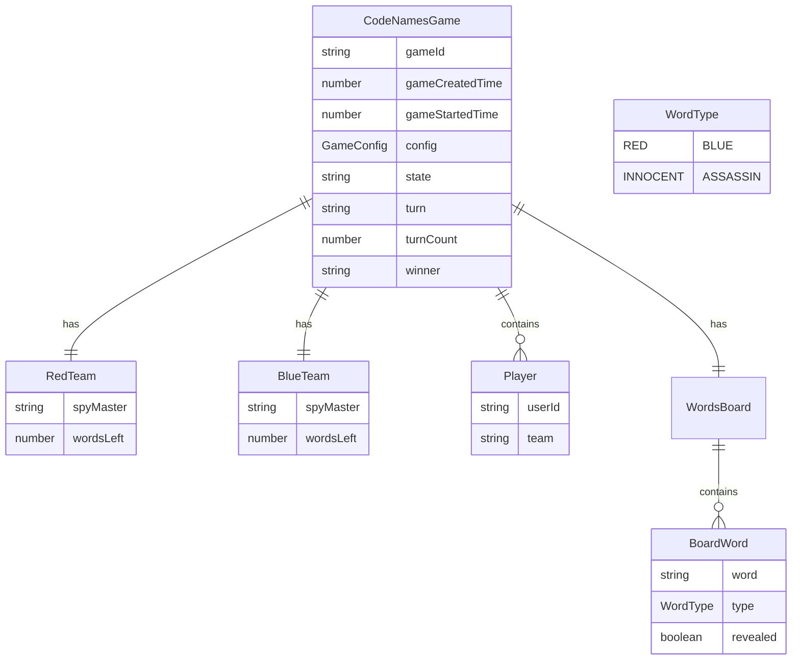
```mermaid
erDiagram
    CodeNamesGame ||--|| RedTeam : has
    CodeNamesGame ||--|| BlueTeam : has
    CodeNamesGame ||--o{ Player : contains
    CodeNamesGame ||--|| WordsBoard : has
    
    WordsBoard ||--o{ BoardWord : contains
    
    CodeNamesGame {
        string gameId
        number gameCreatedTime
        number gameStartedTime
        GameConfig config
        string state
        string turn
        number turnCount
        string winner
    }
    
    RedTeam {
        string spyMaster
        number wordsLeft
    }
    
    BlueTeam {
        string spyMaster
        number wordsLeft
    }
    
    Player {
        string userId
        string team
    }
    
    BoardWord {
        string word
        WordType type
        boolean revealed
    }
    
    WordType {
        RED
        BLUE
        INNOCENT
        ASSASSIN
    }
```

### Board Generation Algorithm

The board generation ensures balanced gameplay with randomized word placement:

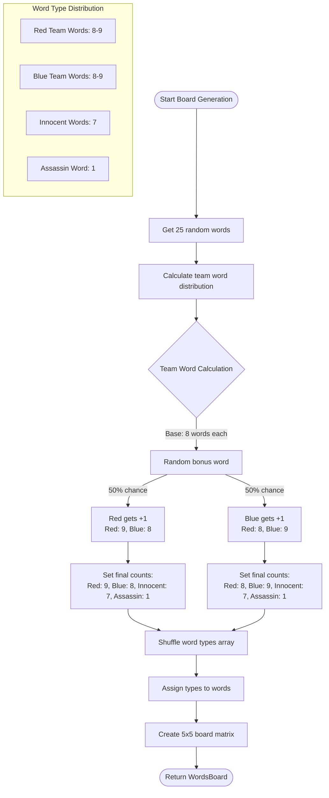
```mermaid
flowchart TD
    Start([Start Board Generation]) --> GetWords[Get 25 random words]
    GetWords --> CalcTeamWords[Calculate team word distribution]
    
    CalcTeamWords --> TeamCalc{Team Word Calculation}
    TeamCalc --> |Base: 8 words each| RandomBonus[Random bonus word]
    RandomBonus --> |50% chance| RedBonus[Red gets +1<br/>Red: 9, Blue: 8]
    RandomBonus --> |50% chance| BlueBonus[Blue gets +1<br/>Red: 8, Blue: 9]
    
    RedBonus --> SetCounts[Set final counts:<br/>Red: 9, Blue: 8, Innocent: 7, Assassin: 1]
    BlueBonus --> SetCounts2[Set final counts:<br/>Red: 8, Blue: 9, Innocent: 7, Assassin: 1]
    
    SetCounts --> ShuffleTypes[Shuffle word types array]
    SetCounts2 --> ShuffleTypes
    ShuffleTypes --> AssignTypes[Assign types to words]
    AssignTypes --> Create5x5[Create 5x5 board matrix]
    Create5x5 --> End([Return WordsBoard])
    
    subgraph "Word Type Distribution"
        RedWords[Red Team Words: 8-9]
        BlueWords[Blue Team Words: 8-9]
        InnocentWords[Innocent Words: 7]
        AssassinWord[Assassin Word: 1]
    end
```

### Turn Management Logic

Turn management follows strict rules to ensure fair gameplay:

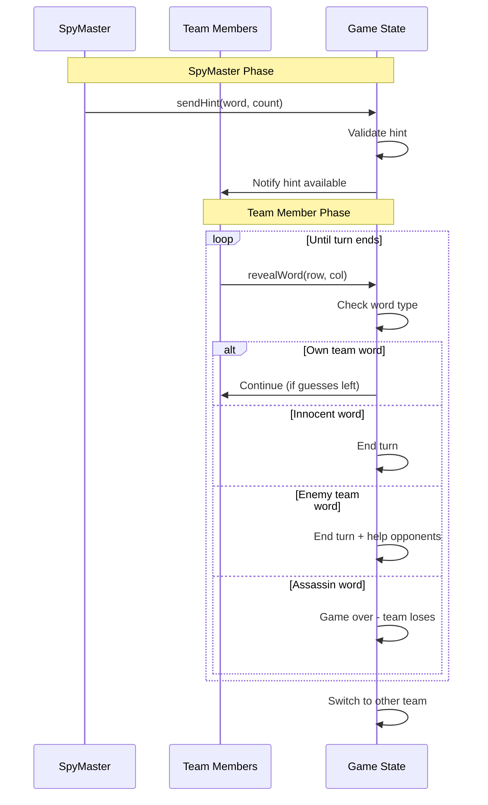
```mermaid
sequenceDiagram
    participant SM as SpyMaster
    participant TM as Team Members
    participant Game as Game State
    
    Note over SM,Game: SpyMaster Phase
    SM->>Game: sendHint(word, count)
    Game->>Game: Validate hint
    Game->>TM: Notify hint available
    
    Note over TM,Game: Team Member Phase
    loop Until turn ends
        TM->>Game: revealWord(row, col)
        Game->>Game: Check word type
        
        alt Own team word
            Game->>TM: Continue (if guesses left)
        else Innocent word
            Game->>Game: End turn
        else Enemy team word
            Game->>Game: End turn + help opponents
        else Assassin word
            Game->>Game: Game over - team loses
        end
    end
    
    Game->>Game: Switch to other team
```

### Validation System Architecture

The validation system uses composable rules for flexible game logic:

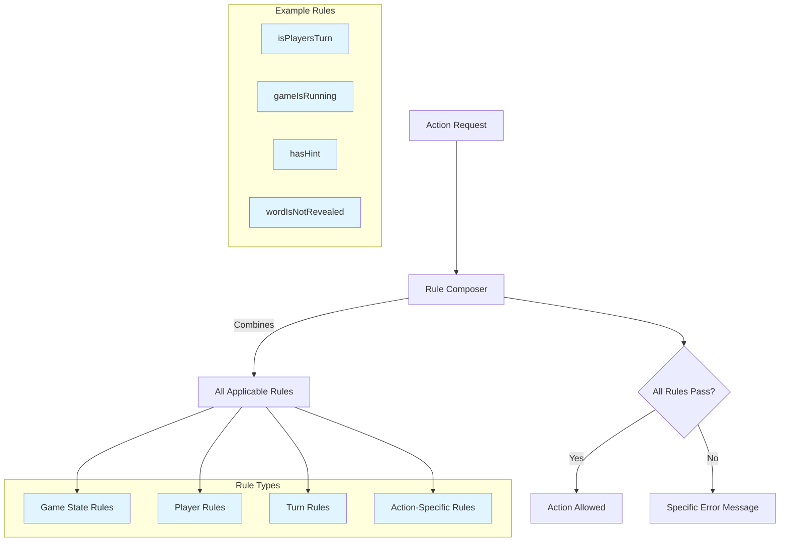
```mermaid
graph TB
    ActionRequest[Action Request] --> RuleComposer[Rule Composer]
    
    RuleComposer --> |Combines| AllRules[All Applicable Rules]
    
    subgraph "Rule Types"
        GameRules[Game State Rules]
        PlayerRules[Player Rules] 
        TurnRules[Turn Rules]
        ActionRules[Action-Specific Rules]
    end
    
    AllRules --> GameRules
    AllRules --> PlayerRules
    AllRules --> TurnRules
    AllRules --> ActionRules
    
    subgraph "Example Rules"
        IsPlayersTurn[isPlayersTurn]
        GameRunning[gameIsRunning]
        HasHint[hasHint]
        WordNotRevealed[wordIsNotRevealed]
    end
    
    RuleComposer --> ValidationResult{All Rules Pass?}
    ValidationResult -->|Yes| Success[Action Allowed]
    ValidationResult -->|No| FailureReason[Specific Error Message]
    
    classDef rule fill:#e1f5fe
    class GameRules,PlayerRules,TurnRules,ActionRules,IsPlayersTurn,GameRunning,HasHint,WordNotRevealed rule
```

---

## Real-time Communication

### Socket.IO Message Flow

Real-time communication is handled through Socket.IO with structured message passing:

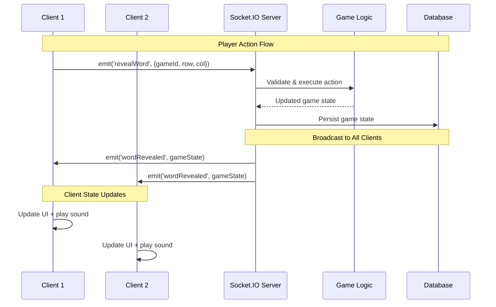
```mermaid
sequenceDiagram
    participant Client1 as Client 1
    participant Client2 as Client 2  
    participant Server as Socket.IO Server
    participant Game as Game Logic
    participant DB as Database
    
    Note over Client1,DB: Player Action Flow
    
    Client1->>Server: emit('revealWord', {gameId, row, col})
    Server->>Game: Validate & execute action
    Game-->>Server: Updated game state
    Server->>DB: Persist game state
    
    Note over Server,DB: Broadcast to All Clients
    
    Server->>Client1: emit('wordRevealed', gameState)
    Server->>Client2: emit('wordRevealed', gameState)
    
    Note over Client1,Client2: Client State Updates
    
    Client1->>Client1: Update UI + play sound
    Client2->>Client2: Update UI + play sound
```

### Message Type Hierarchy

Messages are organized into logical categories for better code organization:


```mermaid
graph TB
    Messages[Socket Messages] --> GameMgmt[Game Management]
    Messages --> PlayerActions[Player Actions]
    Messages --> Gameplay[Gameplay Actions]
    Messages --> System[System Messages]
    
    GameMgmt --> CreateGame[createGame]
    GameMgmt --> JoinGame[joinGame]
    GameMgmt --> StartGame[startGame]
    GameMgmt --> RestartGame[restartGame]
    
    PlayerActions --> JoinTeam[joinTeam]
    PlayerActions --> SetSpyMaster[setSpyMaster]
    PlayerActions --> RandomizeTeam[randomizeTeam]
    PlayerActions --> UpdateConfig[updateConfig]
    
    Gameplay --> SendHint[sendHint]
    Gameplay --> RevealWord[revealWord]
    Gameplay --> ChangeTurn[changeTurn]
    
    System --> Connect[connect]
    System --> Disconnect[disconnect]
    System --> Error[error]
    System --> GameState[gameState]
    
    classDef mgmt fill:#e1f5fe
    classDef player fill:#f3e5f5
    classDef game fill:#e8f5e8
    classDef sys fill:#fff3e0
    
    class GameMgmt,CreateGame,JoinGame,StartGame,RestartGame mgmt
    class PlayerActions,JoinTeam,SetSpyMaster,RandomizeTeam,UpdateConfig player
    class Gameplay,SendHint,RevealWord,ChangeTurn game
    class System,Connect,Disconnect,Error,GameState sys
```

### State Synchronization Strategy

The system uses optimistic updates with server reconciliation:

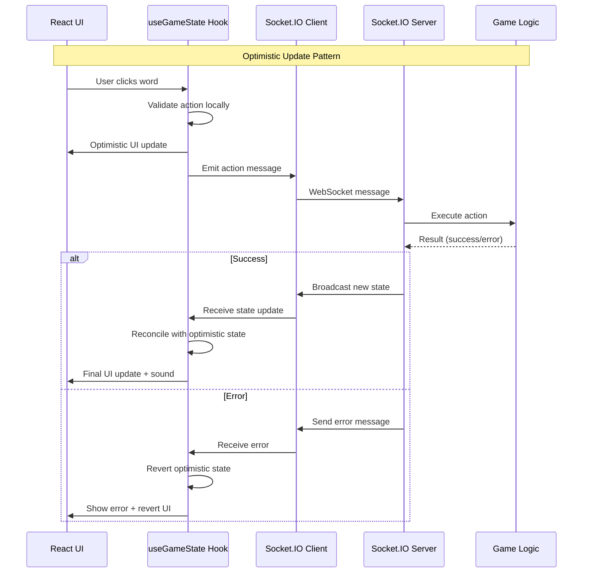
```mermaid
sequenceDiagram
    participant UI as React UI
    participant Hook as useGameState Hook
    participant Socket as Socket.IO Client
    participant Server as Socket.IO Server
    participant Logic as Game Logic
    
    Note over UI,Logic: Optimistic Update Pattern
    
    UI->>Hook: User clicks word
    Hook->>Hook: Validate action locally
    Hook->>UI: Optimistic UI update
    Hook->>Socket: Emit action message
    
    Socket->>Server: WebSocket message
    Server->>Logic: Execute action
    Logic-->>Server: Result (success/error)
    
    alt Success
        Server->>Socket: Broadcast new state
        Socket->>Hook: Receive state update
        Hook->>Hook: Reconcile with optimistic state
        Hook->>UI: Final UI update + sound
    else Error
        Server->>Socket: Send error message
        Socket->>Hook: Receive error
        Hook->>Hook: Revert optimistic state
        Hook->>UI: Show error + revert UI
    end
```

---

## Database Design

### MongoDB Schema Design

The database uses a document-based approach optimized for game state storage:

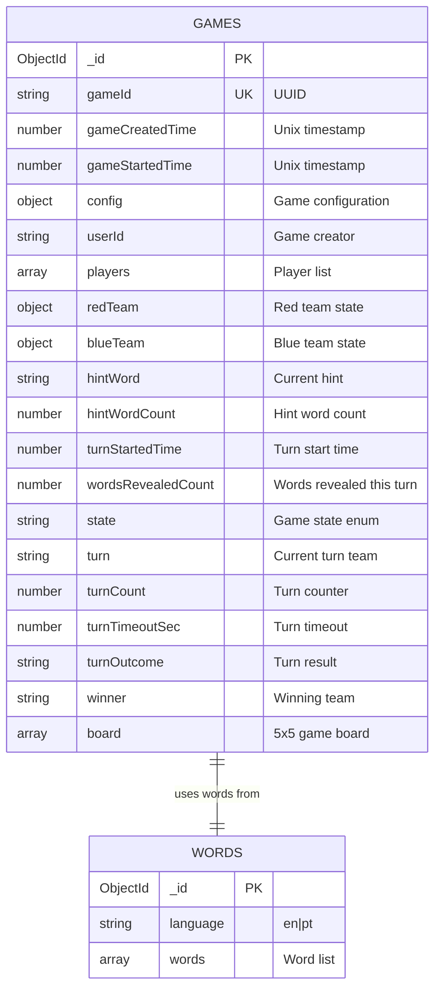
```mermaid
erDiagram
    GAMES {
        ObjectId _id PK
        string gameId UK "UUID"
        number gameCreatedTime "Unix timestamp"
        number gameStartedTime "Unix timestamp"
        object config "Game configuration"
        string userId "Game creator"
        array players "Player list"
        object redTeam "Red team state"
        object blueTeam "Blue team state"
        string hintWord "Current hint"
        number hintWordCount "Hint word count"
        number turnStartedTime "Turn start time"
        number wordsRevealedCount "Words revealed this turn"
        string state "Game state enum"
        string turn "Current turn team"
        number turnCount "Turn counter"
        number turnTimeoutSec "Turn timeout"
        string turnOutcome "Turn result"
        string winner "Winning team"
        array board "5x5 game board"
    }
    
    WORDS {
        ObjectId _id PK
        string language "en|pt"
        array words "Word list"
    }
    
    GAMES ||--|| WORDS : "uses words from"
```

### Repository Pattern Implementation

Data access follows the repository pattern for clean separation:

```mermaid
graph TB
    subgraph "Domain Layer"
        GameLogic[Game Logic]
        DomainPorts[Domain Ports]
    end
    
    subgraph "Repository Abstraction"
        GameRepo[Games Repository Interface]
        WordRepo[Words Repository Interface]
    end
    
    subgraph "MongoDB Implementation"
        MongoGameAdapter[MongoDB Games Adapter]
        MongoWordAdapter[MongoDB Words Adapter]
        MongoClient[MongoDB Client]
    end
    
    GameLogic --> DomainPorts
    DomainPorts --> GameRepo
    DomainPorts --> WordRepo
    
    GameRepo <|.. MongoGameAdapter
    WordRepo <|.. MongoWordAdapter
    
    MongoGameAdapter --> MongoClient
    MongoWordAdapter --> MongoClient
    
    classDef domain fill:#fff3e0
    classDef repo fill:#e1f5fe
    classDef impl fill:#f3e5f5
    
    class GameLogic,DomainPorts domain
    class GameRepo,WordRepo repo
    class MongoGameAdapter,MongoWordAdapter,MongoClient impl
```

---

## Frontend Architecture

### React Component Hierarchy

The frontend follows a hierarchical component structure:

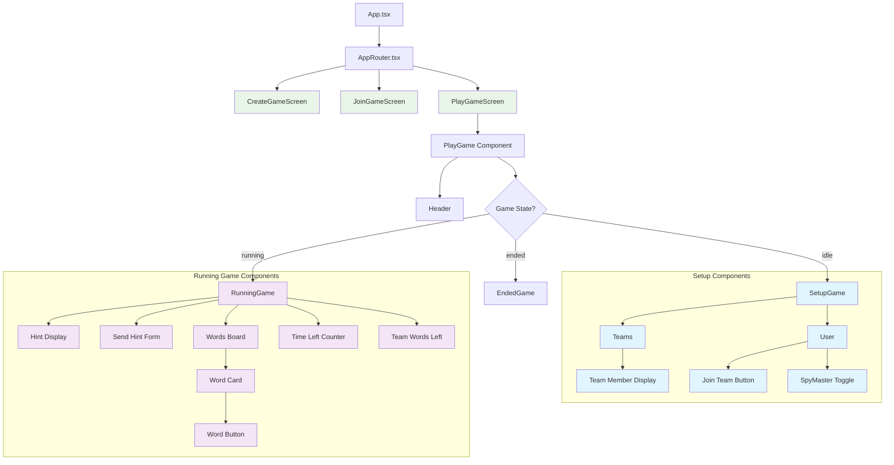
```mermaid
graph TB
    App[App.tsx] --> AppRouter[AppRouter.tsx]
    
    AppRouter --> CreateGame[CreateGameScreen]
    AppRouter --> JoinGame[JoinGameScreen]
    AppRouter --> PlayGame[PlayGameScreen]
    
    PlayGame --> PlayGameComponent[PlayGame Component]
    
    PlayGameComponent --> Header[Header]
    PlayGameComponent --> GameContent{Game State?}
    
    GameContent -->|idle| SetupGame[SetupGame]
    GameContent -->|running| RunningGame[RunningGame]
    GameContent -->|ended| EndedGame[EndedGame]
    
    subgraph "Setup Components"
        SetupGame --> Teams[Teams]
        SetupGame --> User[User]
        Teams --> TeamDisplay[Team Member Display]
        User --> JoinTeamButton[Join Team Button]
        User --> SpyMasterToggle[SpyMaster Toggle]
    end
    
    subgraph "Running Game Components"
        RunningGame --> Hint[Hint Display]
        RunningGame --> SendHint[Send Hint Form]
        RunningGame --> WordsBoard[Words Board]
        RunningGame --> TimeLeft[Time Left Counter]
        RunningGame --> TeamWordsLeft[Team Words Left]
        
        WordsBoard --> WordCard[Word Card]
        WordCard --> WordButton[Word Button]
    end
    
    classDef screen fill:#e8f5e8
    classDef setup fill:#e1f5fe
    classDef running fill:#f3e5f5
    
    class CreateGame,JoinGame,PlayGame screen
    class SetupGame,Teams,User,TeamDisplay,JoinTeamButton,SpyMasterToggle setup
    class RunningGame,Hint,SendHint,WordsBoard,TimeLeft,TeamWordsLeft,WordCard,WordButton running
```

### State Management Architecture

Custom hooks manage state without external libraries:

```mermaid
graph TB
    subgraph "React State Management"
        LocalState[Local Component State<br/>useState]
        GameState[Game State Hook<br/>useGameState]
        MessagingState[Messaging State<br/>usePlayGameMessaging]
    end
    
    subgraph "Custom Hooks"
        UseGameState[useGameState.ts]
        UseMessaging[usePlayGameMessaging.ts]
        UseSocket[useGameMessaging.ts]
        UseSound[usePlaySound.ts]
        UseApi[useApi.tsx]
    end
    
    subgraph "External State"
        CoreLogic[@codenames50/core<br/>Game Logic]
        SocketIO[Socket.IO Client<br/>Real-time Updates]
        LocalStorage[Browser Local Storage<br/>User Preferences]
    end
    
    LocalState --> UseGameState
    GameState --> UseGameState
    MessagingState --> UseMessaging
    
    UseGameState --> CoreLogic
    UseMessaging --> UseSocket
    UseSocket --> SocketIO
    UseSound --> LocalStorage
    UseApi --> SocketIO
    
    classDef state fill:#e8f5e8
    classDef hooks fill:#e1f5fe
    classDef external fill:#f3e5f5
    
    class LocalState,GameState,MessagingState state
    class UseGameState,UseMessaging,UseSocket,UseSound,UseApi hooks
    class CoreLogic,SocketIO,LocalStorage external
```

---

## Development Guide

### Build Pipeline

The build system supports both development and production workflows:

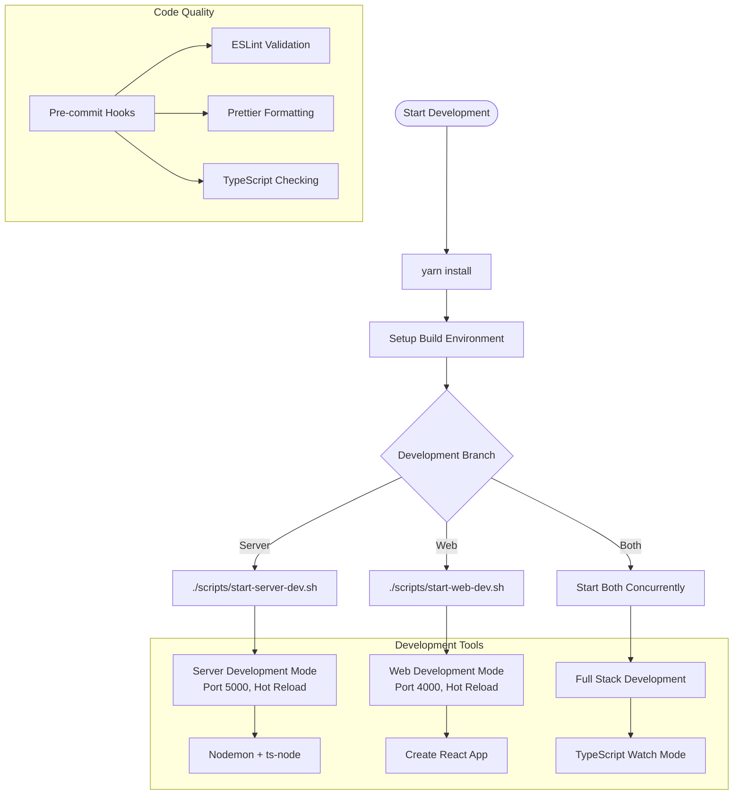
```mermaid
flowchart TD
    Start([Start Development]) --> Install[yarn install]
    Install --> BuildSetup[Setup Build Environment]
    
    BuildSetup --> DevBranch{Development Branch}
    DevBranch -->|Server| StartServer[./scripts/start-server-dev.sh]
    DevBranch -->|Web| StartWeb[./scripts/start-web-dev.sh]
    DevBranch -->|Both| StartBoth[Start Both Concurrently]
    
    StartServer --> ServerDev[Server Development Mode<br/>Port 5000, Hot Reload]
    StartWeb --> WebDev[Web Development Mode<br/>Port 4000, Hot Reload]
    StartBoth --> BothDev[Full Stack Development]
    
    subgraph "Development Tools"
        ServerDev --> Nodemon[Nodemon + ts-node]
        WebDev --> CRA[Create React App]
        BothDev --> TypeScriptWatch[TypeScript Watch Mode]
    end
    
    subgraph "Code Quality"
        PreCommit[Pre-commit Hooks]
        ESLint[ESLint Validation]
        Prettier[Prettier Formatting]
        TypeCheck[TypeScript Checking]
        
        PreCommit --> ESLint
        PreCommit --> Prettier
        PreCommit --> TypeCheck
    end
```

### Testing Strategy

Comprehensive testing covers all application layers:

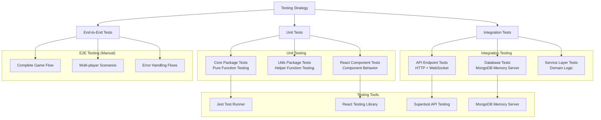
```mermaid
graph TB
    TestStrategy[Testing Strategy] --> UnitTests[Unit Tests]
    TestStrategy --> IntegrationTests[Integration Tests]
    TestStrategy --> E2ETests[End-to-End Tests]
    
    subgraph "Unit Testing"
        CoreUnit[Core Package Tests<br/>Pure Function Testing]
        UtilsUnit[Utils Package Tests<br/>Helper Function Testing]
        ComponentUnit[React Component Tests<br/>Component Behavior]
    end
    
    subgraph "Integration Testing"
        APITests[API Endpoint Tests<br/>HTTP + WebSocket]
        DatabaseTests[Database Tests<br/>MongoDB Memory Server]
        ServiceTests[Service Layer Tests<br/>Domain Logic]
    end
    
    subgraph "E2E Testing (Manual)"
        GameFlow[Complete Game Flow]
        MultiPlayer[Multi-player Scenarios]
        ErrorHandling[Error Handling Flows]
    end
    
    UnitTests --> CoreUnit
    UnitTests --> UtilsUnit
    UnitTests --> ComponentUnit
    
    IntegrationTests --> APITests
    IntegrationTests --> DatabaseTests
    IntegrationTests --> ServiceTests
    
    E2ETests --> GameFlow
    E2ETests --> MultiPlayer
    E2ETests --> ErrorHandling
    
    subgraph "Testing Tools"
        Jest[Jest Test Runner]
        RTL[React Testing Library]
        Supertest[Supertest API Testing]
        MemoryDB[MongoDB Memory Server]
    end
    
    CoreUnit --> Jest
    ComponentUnit --> RTL
    APITests --> Supertest
    DatabaseTests --> MemoryDB
```

### Development Workflow

The development process follows established best practices:

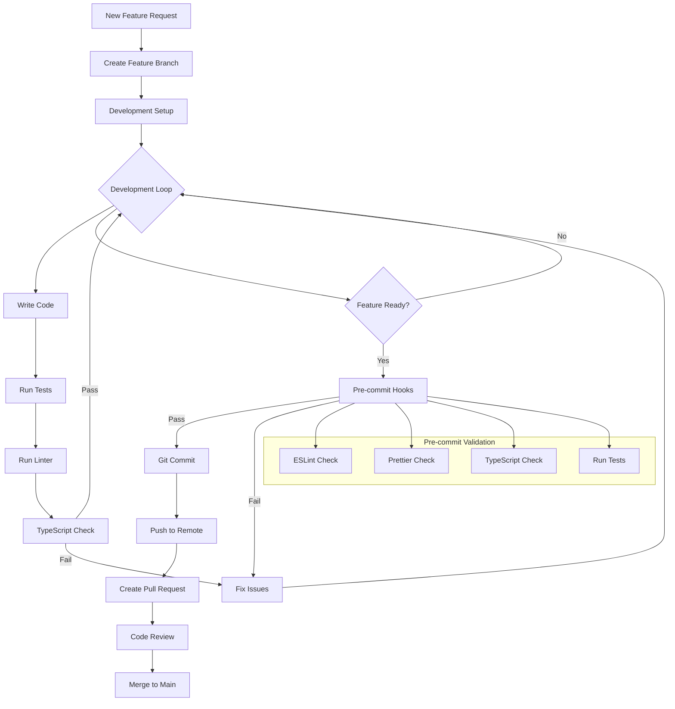
```mermaid
flowchart TD
    Feature[New Feature Request] --> Branch[Create Feature Branch]
    Branch --> Setup[Development Setup]
    
    Setup --> DevLoop{Development Loop}
    
    DevLoop --> Code[Write Code]
    Code --> Test[Run Tests]
    Test --> Lint[Run Linter]
    Lint --> TypeCheck[TypeScript Check]
    
    TypeCheck -->|Pass| DevLoop
    TypeCheck -->|Fail| Fix[Fix Issues]
    Fix --> DevLoop
    
    DevLoop --> Ready{Feature Ready?}
    Ready -->|No| DevLoop
    Ready -->|Yes| PreCommit[Pre-commit Hooks]
    
    PreCommit --> |Pass| Commit[Git Commit]
    PreCommit --> |Fail| Fix
    
    Commit --> Push[Push to Remote]
    Push --> PR[Create Pull Request]
    PR --> Review[Code Review]
    Review --> Merge[Merge to Main]
    
    subgraph "Pre-commit Validation"
        LintCheck[ESLint Check]
        FormatCheck[Prettier Check]
        TypeScriptCheck[TypeScript Check]
        TestsCheck[Run Tests]
    end
    
    PreCommit --> LintCheck
    PreCommit --> FormatCheck
    PreCommit --> TypeScriptCheck
    PreCommit --> TestsCheck
```

---

## Appendices

### Appendix A: Development Commands

#### Package Management
```bash
yarn install                    # Install all dependencies
yarn workspace @codenames50/server add lodash    # Add dependency to specific package
yarn workspace @codenames50/web remove old-lib  # Remove dependency
```

#### Development Servers
```bash
./scripts/start-server-dev.sh   # Start server with hot reload
./scripts/start-web-dev.sh      # Start web app with dev server
yarn workspace @codenames50/server start:dev    # Alternative server start
yarn workspace @codenames50/web start:dev       # Alternative web start
```

#### Building & Testing
```bash
yarn build                      # Build all packages
yarn test                       # Run all tests
yarn test:watch                 # Run tests in watch mode
yarn coverage                   # Generate test coverage
yarn lint                       # Run ESLint
yarn pretty:fix                 # Format code with Prettier
```

### Appendix B: Environment Configuration

#### Local Development
- **Server**: http://localhost:5000
- **Web**: http://localhost:4000
- **Database**: mongodb://localhost:27017/codenames50

#### Production
- **API**: https://codenames50-api.herokuapp.com
- **Web**: https://codenames50-web.herokuapp.com
- **Database**: MongoDB Atlas cluster

### Appendix C: Key File Locations

#### Core Game Logic
- `packages/core/src/models.ts` - Game data models
- `packages/core/src/actions.ts` - State transformations
- `packages/core/src/rules.ts` - Validation logic
- `packages/core/src/ports.ts` - Public API

#### Server Implementation
- `packages/server/src/sockets/handlers.ts` - WebSocket handlers
- `packages/server/src/domain/main.ts` - Business logic
- `packages/server/src/mongodb/games.ts` - Database operations

#### Frontend Components
- `packages/web/src/screens/PlayGame/PlayGameScreen.tsx` - Main game interface
- `packages/web/src/utils/useGameState.ts` - Game state management
- `packages/web/src/utils/usePlayGameMessaging.ts` - WebSocket integration

### Appendix D: Design Patterns Summary

1. **Hexagonal Architecture**: Clean separation between core logic and infrastructure
2. **Repository Pattern**: Abstract data access with concrete MongoDB implementations
3. **Command Pattern**: Game actions as composable functions
4. **Observer Pattern**: Real-time updates through Socket.IO events
5. **Strategy Pattern**: Validation rules as pluggable components
6. **Functional Programming**: Immutable state transformations with Ramda/FP-TS

---

**Document End**

*This documentation was generated for the Codenames50 project to provide comprehensive technical guidance for developers working with the codebase.*