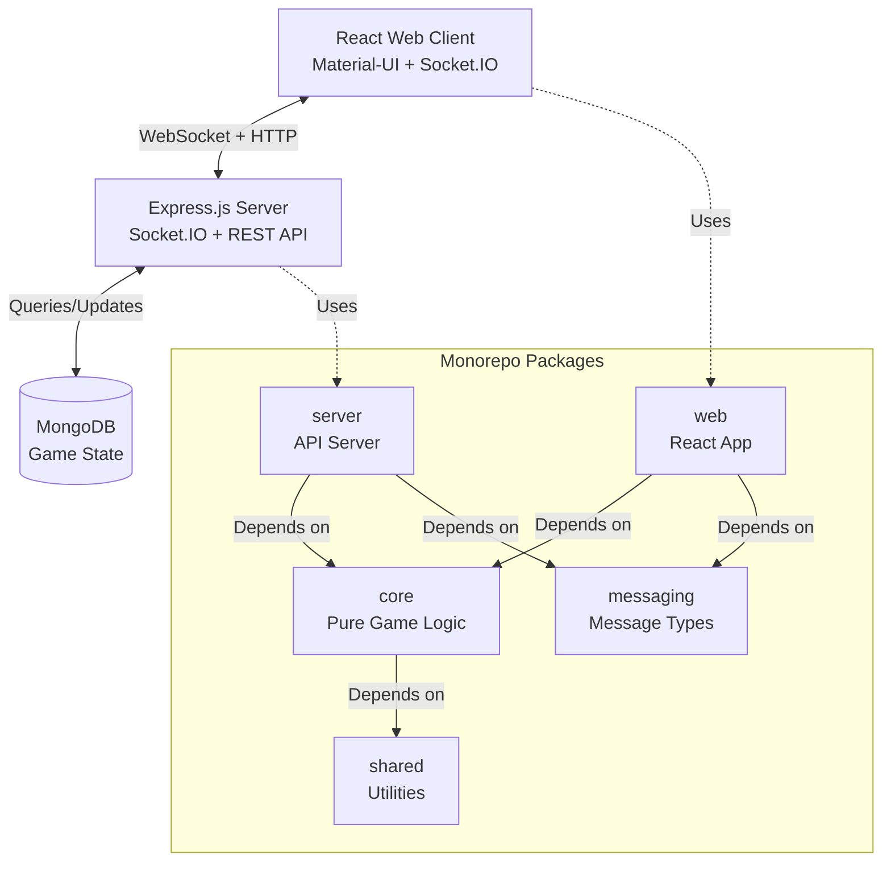
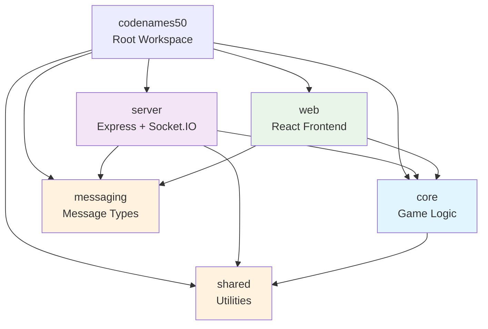
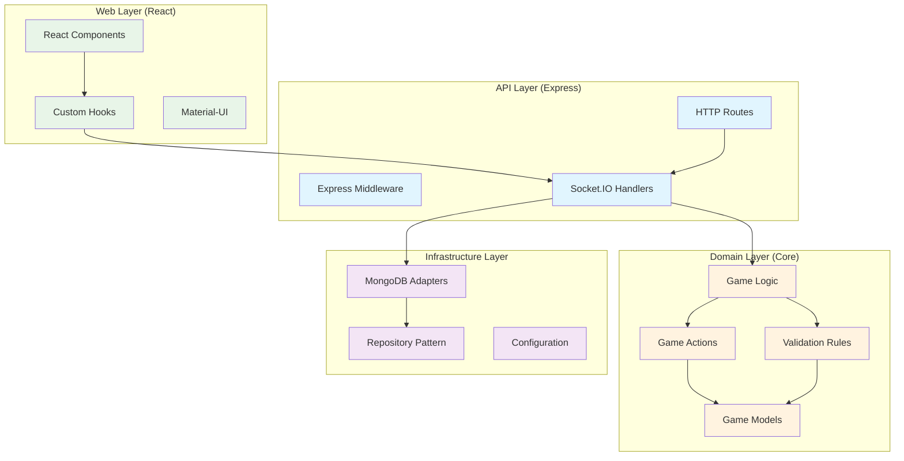
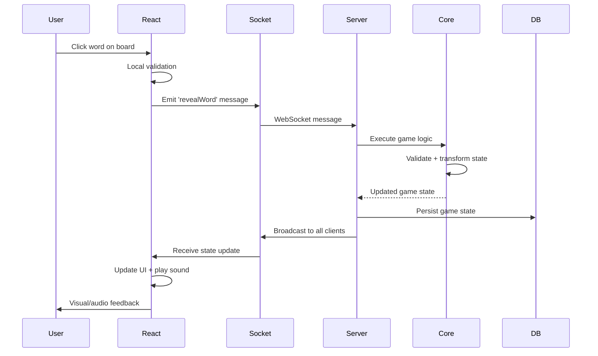
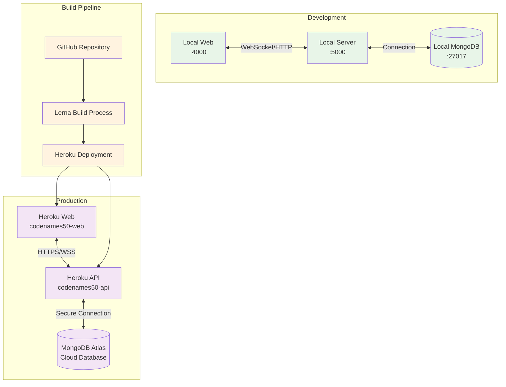

# System Architecture

## High-Level Overview



## Technology Stack

```mermaid
graph LR
    subgraph "Frontend"
        React[React 18.3]
        MUI[Material-UI v7]
        TS1[TypeScript 5.6]
        SocketClient[Socket.IO Client 4.7.5]
        Router[React Router v6]
        Vite[Vite Build System]
    end
    
    subgraph "Backend"
        Express[Express.js 4.17]
        SocketServer[Socket.IO 4.7.5]
        Node[Node.js 20+]
        TS2[TypeScript 5.6]
    end
    
    subgraph "Data Layer"
        MongoDB[MongoDB 6.0]
        Atlas[MongoDB Atlas<br/>Production]
    end
    
    subgraph "Build & Testing System"
        Lerna[Lerna 8.1]
        Yarn[Yarn Workspaces]
        TSProject[TS Project References]
        Vitest[Vitest Testing]
        ESLint9[ESLint v9]
    end
    
    Frontend <-->|Real-time| Backend
    Backend <-->|Persistence| Data Layer
    Build & Testing System -.->|Manages| Frontend
    Build & Testing System -.->|Manages| Backend
```

## Package Dependencies



## Clean Architecture Layers



## Data Flow Architecture



## Deployment Architecture



## Design Patterns Used

### 1. Hexagonal Architecture (Ports & Adapters)

- **Core** contains pure business logic
- **Ports** define interfaces for external dependencies
- **Adapters** implement infrastructure concerns

### 2. Repository Pattern

- Abstract data access behind interfaces
- MongoDB adapters implement repository interfaces
- Enables testing with in-memory implementations

### 3. Functional Programming

- **Pure functions** for game state transformations
- **Immutable data structures** using Ramda
- **Function composition** for complex operations
- **Monadic error handling** with FP-TS

### 4. Command Pattern

- Game actions as composable functions
- State transformations through command pipelines
- Undo/redo capabilities (future enhancement)

### 5. Observer Pattern

- Socket.IO for real-time state synchronization
- Event-driven architecture for game updates
- Reactive UI updates through React hooks