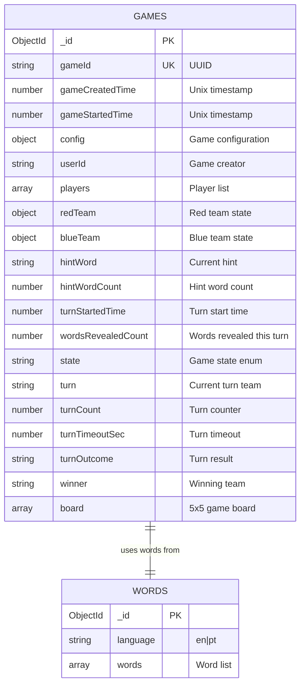
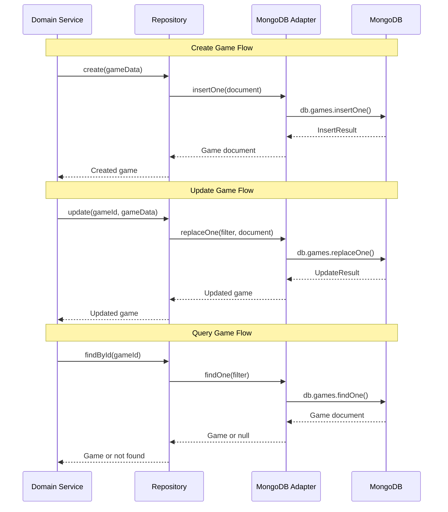
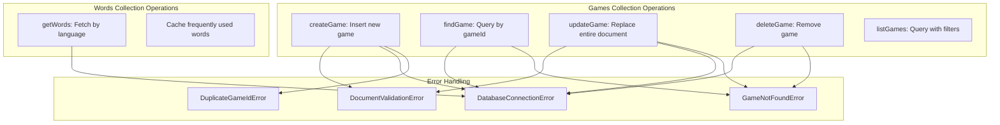
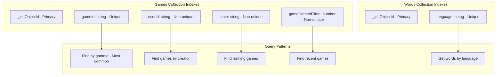
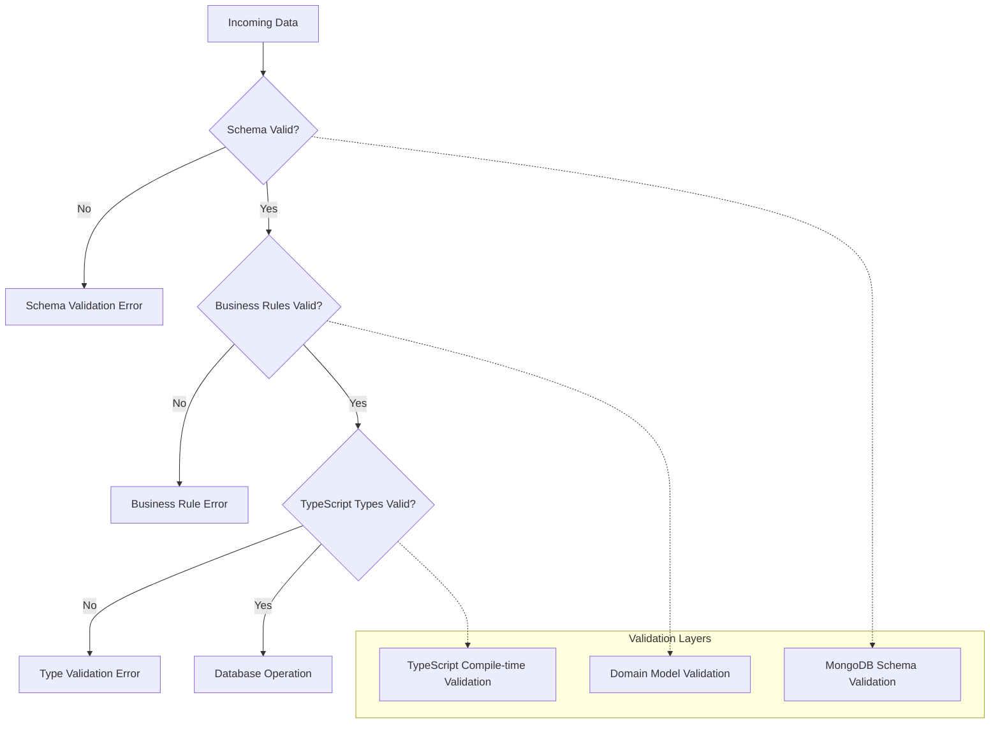
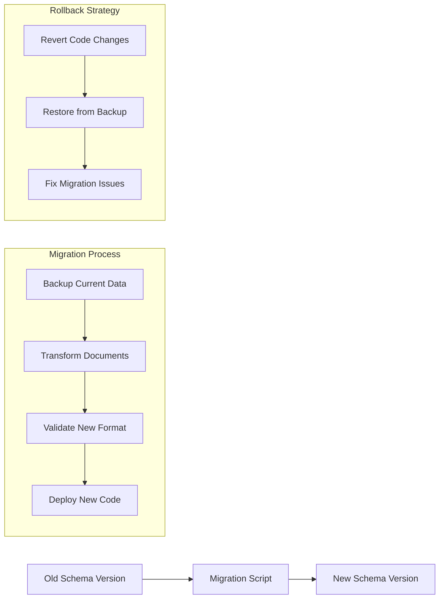

# Database Design

## MongoDB Schema Design



## Game Document Structure

```mermaid
graph TB
    GameDoc[Game Document] --> Metadata[Game Metadata]
    GameDoc --> PlayerData[Player Data]
    GameDoc --> TeamData[Team Data]
    GameDoc --> TurnData[Turn Data]
    GameDoc --> BoardData[Board Data]
    
    subgraph "Metadata Fields"
        GameId[gameId: string]
        CreatedTime[gameCreatedTime: number]
        StartedTime[gameStartedTime: number]
        State[state: 'idle'|'running'|'ended']
        Config[config: GameConfig]
    end
    
    subgraph "Player Data"
        Creator[userId: string]
        PlayersList[players: Player[]]
        PlayerSchema[Player: {userId, team?}]
    end
    
    subgraph "Team Data"
        RedTeam[redTeam: TeamConfig]
        BlueTeam[blueTeam: TeamConfig]
        TeamSchema[TeamConfig: {spyMaster?, wordsLeft?}]
    end
    
    subgraph "Turn Data"
        CurrentTurn[turn: 'red'|'blue']
        TurnCount[turnCount: number]
        HintWord[hintWord: string]
        HintCount[hintWordCount: number]
        TurnStart[turnStartedTime: number]
        WordsRevealed[wordsRevealedCount: number]
        TurnTimeout[turnTimeoutSec: number]
        TurnOutcome[turnOutcome: string]
        Winner[winner: string]
    end
    
    subgraph "Board Data"
        Board[board: BoardWord[][]]
        BoardSchema[BoardWord: {word, type, revealed}]
        WordTypes[type: 'red'|'blue'|'innocent'|'assassin']
    end
```

## Repository Pattern Implementation

```mermaid
graph TB
    subgraph "Domain Layer"
        GameLogic[Game Logic]
        DomainPorts[Domain Ports]
    end
    
    subgraph "Repository Abstraction"
        GameRepo[Games Repository Interface]
        WordRepo[Words Repository Interface]
    end
    
    subgraph "MongoDB Implementation"
        MongoGameAdapter[MongoDB Games Adapter]
        MongoWordAdapter[MongoDB Words Adapter]
        MongoClient[MongoDB Client]
    end
    
    GameLogic --> DomainPorts
    DomainPorts --> GameRepo
    DomainPorts --> WordRepo
    
    GameRepo <|.. MongoGameAdapter
    WordRepo <|.. MongoWordAdapter
    
    MongoGameAdapter --> MongoClient
    MongoWordAdapter --> MongoClient
    
    classDef domain fill:#fff3e0
    classDef repo fill:#e1f5fe
    classDef impl fill:#f3e5f5
    
    class GameLogic,DomainPorts domain
    class GameRepo,WordRepo repo
    class MongoGameAdapter,MongoWordAdapter,MongoClient impl
```

## Data Access Patterns



## FP-TS Integration

```mermaid
graph LR
    Input[Input Parameters] --> Reader[Reader<Dependencies>]
    Reader --> Task[Task<Database Operation>]
    Task --> Either[Either<Error, Result>]
    
    subgraph "Monad Stack: ReaderTaskEither"
        ReaderLayer[Reader: Dependency Injection]
        TaskLayer[Task: Async Operations]
        EitherLayer[Either: Error Handling]
    end
    
    Reader -.-> ReaderLayer
    Task -.-> TaskLayer
    Either -.-> EitherLayer
    
    subgraph "Example: findGame"
        FindGame[findGame(gameId)]
        Dependencies[Dependencies: {gamesRepo}]
        AsyncOp[Async DB Query]
        ErrorHandling[Success | DatabaseError]
    end
    
    FindGame --> Dependencies
    Dependencies --> AsyncOp
    AsyncOp --> ErrorHandling
```

## Database Operations



## Indexing Strategy



## Data Validation



## Connection Management

```mermaid
graph TB
    subgraph "Development Environment"
        DevApp[Development App]
        LocalMongo[(Local MongoDB)]
        DevApp <--> LocalMongo
    end
    
    subgraph "Production Environment"
        ProdApp[Production App<br/>Heroku]
        MongoAtlas[(MongoDB Atlas<br/>Cloud)]
        ProdApp <--> MongoAtlas
    end
    
    subgraph "Connection Configuration"
        EnvVars[Environment Variables]
        ConnString[Connection String]
        ConnPool[Connection Pooling]
        Retry[Retry Logic]
        
        EnvVars --> ConnString
        ConnString --> ConnPool
        ConnPool --> Retry
    end
    
    subgraph "Testing Environment"
        TestApp[Test App]
        MemoryMongo[(MongoDB Memory Server)]
        TestApp <--> MemoryMongo
    end
```



## Data Migration Strategy



## Performance Optimization

```mermaid
graph TB
    subgraph "Query Optimization"
        Indexes[Proper Indexing]
        Projection[Field Projection]
        Limit[Query Limits]
        Aggregation[Aggregation Pipeline]
    end
    
    subgraph "Connection Optimization"
        Pooling[Connection Pooling]
        KeepAlive[Keep-Alive Settings]
        Timeout[Connection Timeouts]
    end
    
    subgraph "Data Optimization"
        Compression[Document Compression]
        Denormalization[Strategic Denormalization]
        Archiving[Archive Old Games]
        Cleanup[Cleanup Abandoned Games]
    end
    
    subgraph "Monitoring"
        Metrics[Performance Metrics]
        Logging[Query Logging]
        Alerts[Performance Alerts]
    end
    
    Performance[Database Performance] --> Indexes
    Performance --> Pooling
    Performance --> Compression
    Performance --> Metrics
```



## Key Implementation Files

### Repository Interfaces (`packages/server/src/repositories/`)
- **`games.ts`** - Games repository interface and implementation
- **`words.ts`** - Words repository interface for static word lists
- **`adapters.ts`** - Repository adapter type definitions

### MongoDB Adapters (`packages/server/src/mongodb/`)
- **`games.ts`** - MongoDB-specific games operations
- **`words.ts`** - MongoDB-specific words operations  
- **`main.ts`** - Database connection and setup

### Static Data (`packages/server/src/repositories/static/`)
- **`words-en.ts`** - English word list for game boards
- **`words-pt.ts`** - Portuguese word list for game boards

This database design provides efficient storage and retrieval of game state while maintaining data integrity and supporting the real-time multiplayer requirements of the Codenames game.