# Development Guide

## Build Pipeline

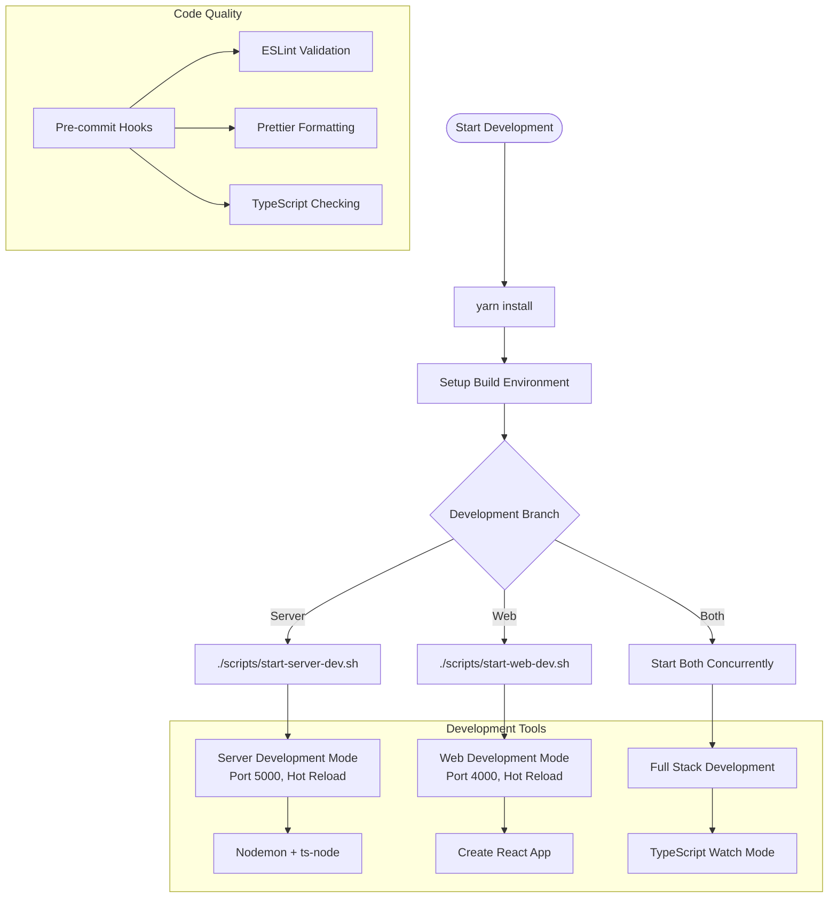

## Production Build Process

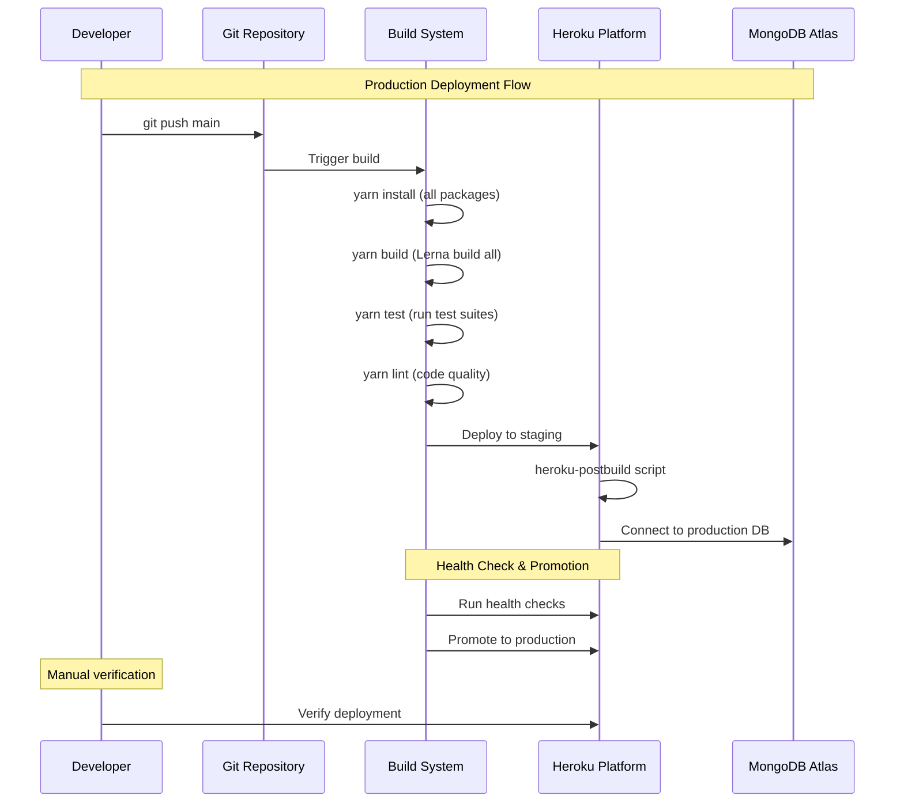

## TypeScript Configuration Strategy

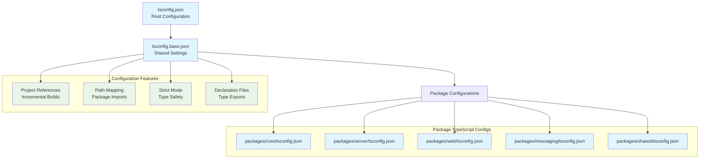

## Testing Strategy

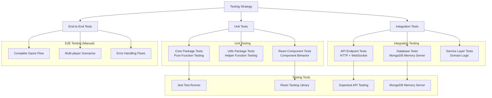

## Development Workflow

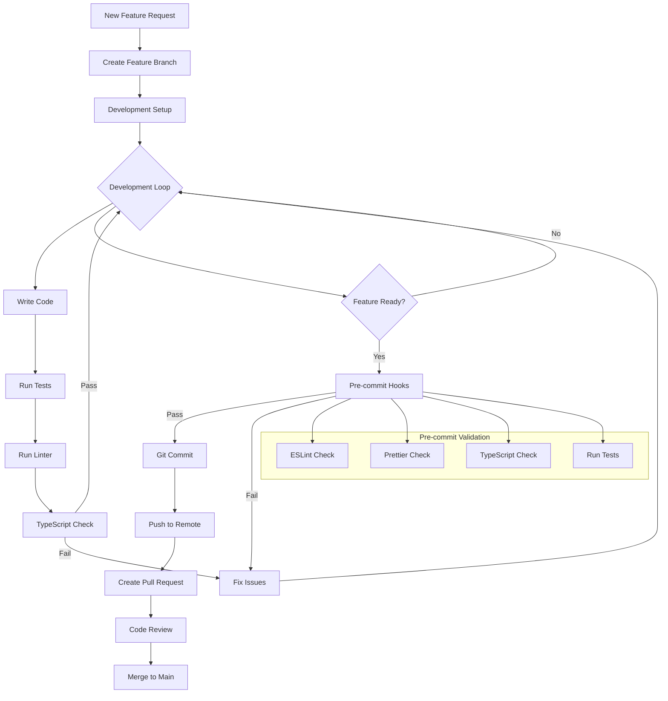

## Environment Configuration

```mermaid
graph TB
    Environments[Development Environments] --> Local[Local Development]
    Environments --> Staging[Staging Environment]
    Environments --> Production[Production Environment]
    
    subgraph "Local Development"
        LocalServer[Server: localhost:5000]
        LocalWeb[Web: localhost:4000]
        LocalMongo[MongoDB: localhost:27017]
        LocalEnv[.env files for config]
    end
    
    subgraph "Staging Environment"
        StagingServer[Staging API Server]
        StagingWeb[Staging Web App]
        StagingDB[Staging MongoDB Atlas]
        StagingEnv[Heroku Config Vars]
    end
    
    subgraph "Production Environment"
        ProdServer[Production API Server]
        ProdWeb[Production Web App]
        ProdDB[Production MongoDB Atlas]
        ProdEnv[Production Config Vars]
    end
    
    Local --> LocalServer
    Local --> LocalWeb
    Local --> LocalMongo
    Local --> LocalEnv
    
    Staging --> StagingServer
    Staging --> StagingWeb
    Staging --> StagingDB
    Staging --> StagingEnv
    
    Production --> ProdServer
    Production --> ProdWeb
    Production --> ProdDB
    Production --> ProdEnv
```

## Debugging Strategies

```mermaid
flowchart TD
    Issue[Development Issue] --> Category{Issue Category}
    
    Category -->|Frontend| FrontendDebug[Frontend Debugging]
    Category -->|Backend| BackendDebug[Backend Debugging]
    Category -->|Database| DatabaseDebug[Database Debugging]
    Category -->|Real-time| RealtimeDebug[Real-time Debugging]
    
    subgraph "Frontend Debugging"
        ReactDevTools[React Developer Tools]
        BrowserDevTools[Browser Developer Tools]
        ConsoleLogging[Console Logging]
        StateInspection[State Inspection]
    end
    
    subgraph "Backend Debugging"
        NodeInspector[Node.js Inspector]
        ServerLogging[Server Logging]
        APITesting[API Testing Tools]
        MongoLogs[MongoDB Logs]
    end
    
    subgraph "Database Debugging"
        MongoCompass[MongoDB Compass]
        QueryProfiling[Query Profiling]
        IndexAnalysis[Index Analysis]
        DataValidation[Data Validation]
    end
    
    subgraph "Real-time Debugging"
        SocketIODebug[Socket.IO Debug Mode]
        NetworkTab[Browser Network Tab]
        MessageLogging[Message Logging]
        ConnectionMonitoring[Connection Monitoring]
    end
    
    FrontendDebug --> ReactDevTools
    FrontendDebug --> BrowserDevTools
    FrontendDebug --> ConsoleLogging
    FrontendDebug --> StateInspection
    
    BackendDebug --> NodeInspector
    BackendDebug --> ServerLogging
    BackendDebug --> APITesting
    BackendDebug --> MongoLogs
    
    DatabaseDebug --> MongoCompass
    DatabaseDebug --> QueryProfiling
    DatabaseDebug --> IndexAnalysis
    DatabaseDebug --> DataValidation
    
    RealtimeDebug --> SocketIODebug
    RealtimeDebug --> NetworkTab
    RealtimeDebug --> MessageLogging
    RealtimeDebug --> ConnectionMonitoring
```

## Deployment Architecture

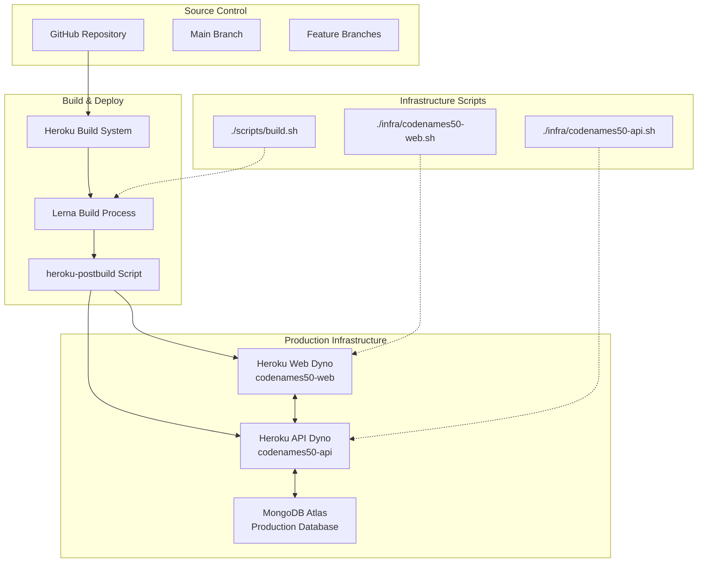

## Performance Monitoring

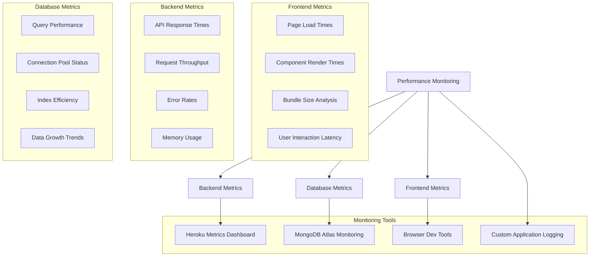

## Common Development Tasks

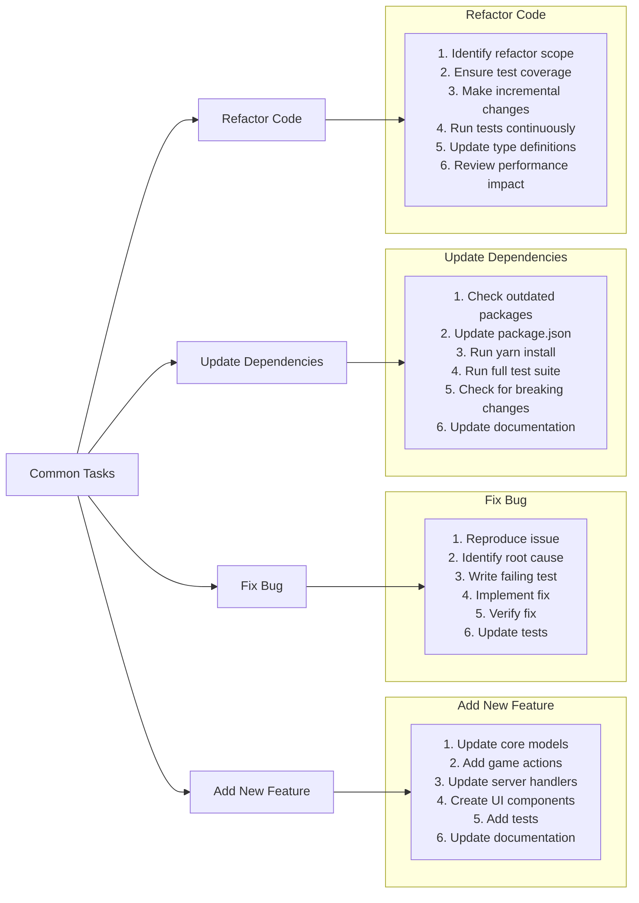

## Development Best Practices

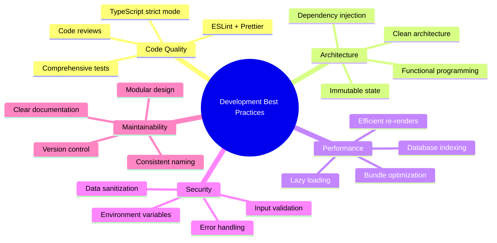

## Key Development Commands

### Package Management
```bash
yarn install                    # Install all dependencies
yarn workspace @codenames50/server add lodash    # Add dependency to specific package
yarn workspace @codenames50/web remove old-lib  # Remove dependency
```

### Development Servers
```bash
./scripts/start-server-dev.sh   # Start server with hot reload
./scripts/start-web-dev.sh      # Start web app with dev server
yarn workspace @codenames50/server start:dev    # Alternative server start
yarn workspace @codenames50/web start:dev       # Alternative web start
```

### Building & Testing
```bash
yarn build                      # Build all packages
yarn test                       # Run all tests
yarn test:watch                 # Run tests in watch mode
yarn coverage                   # Generate test coverage
yarn lint                       # Run ESLint
yarn pretty:fix                 # Format code with Prettier
```

### Package-Specific Commands
```bash
yarn workspace @codenames50/core test           # Test core package
yarn workspace @codenames50/server build        # Build server
yarn workspace @codenames50/web start           # Start web in production mode
```

This development guide provides comprehensive information for setting up, building, testing, and deploying the Codenames50 application with best practices for maintainable code and efficient workflows.