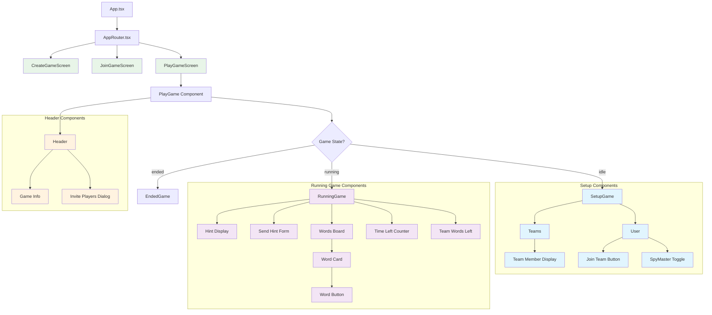
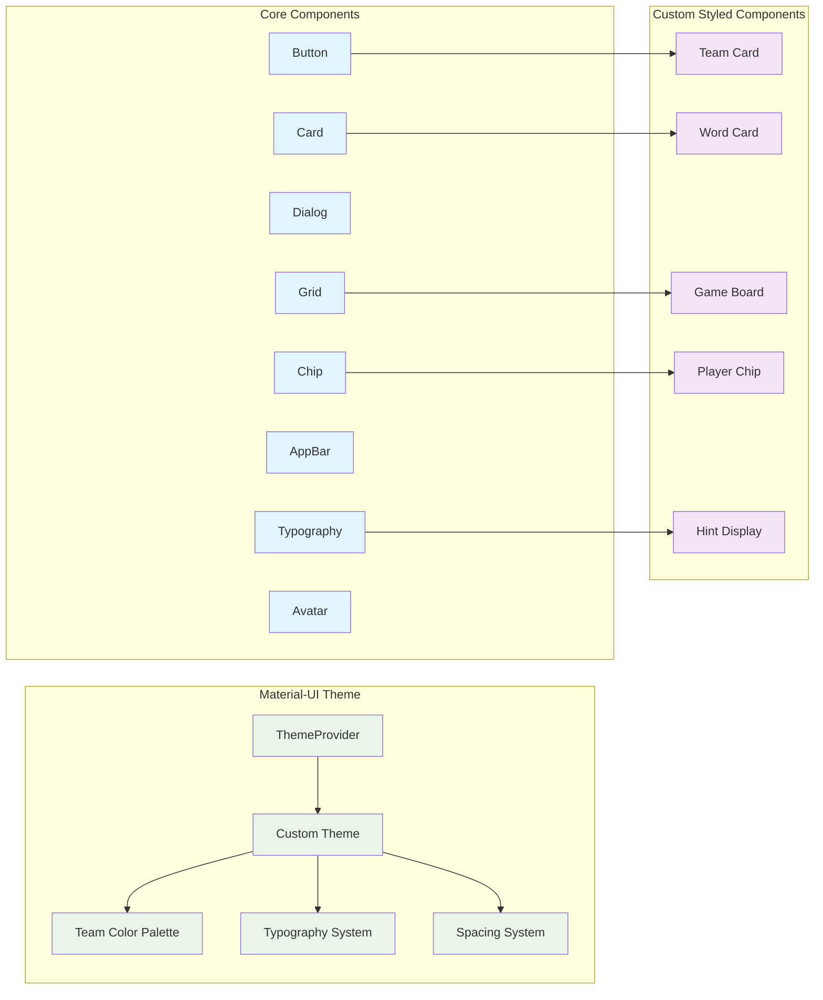
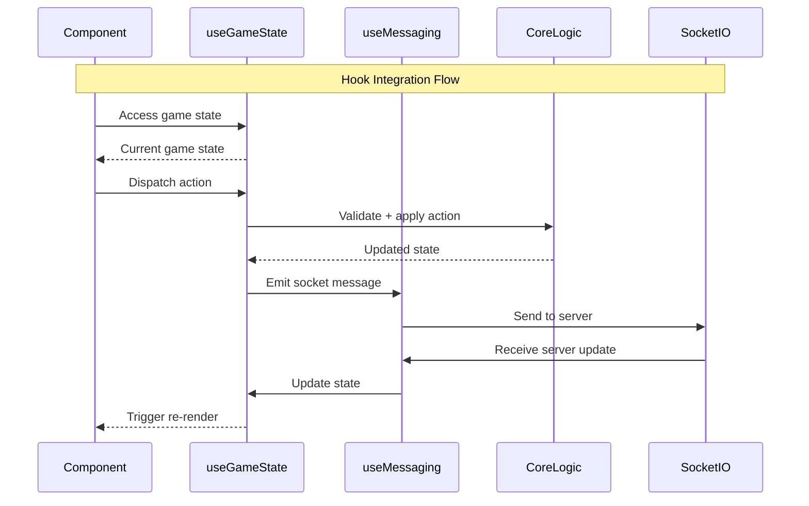
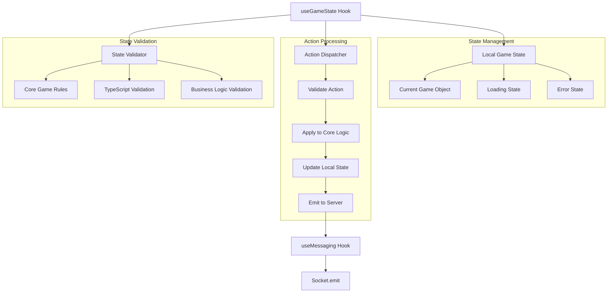
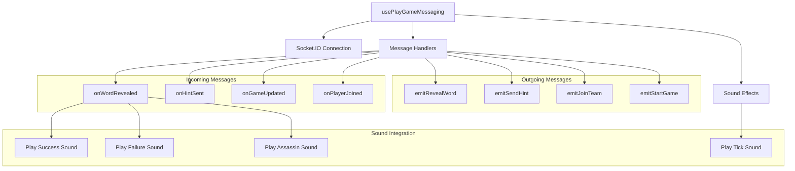
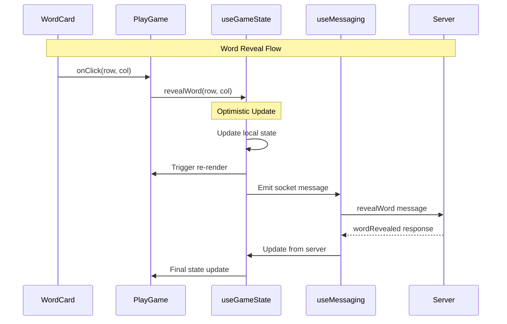
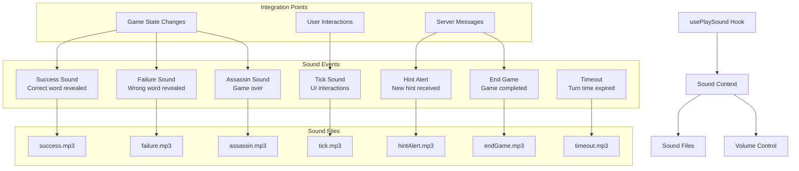
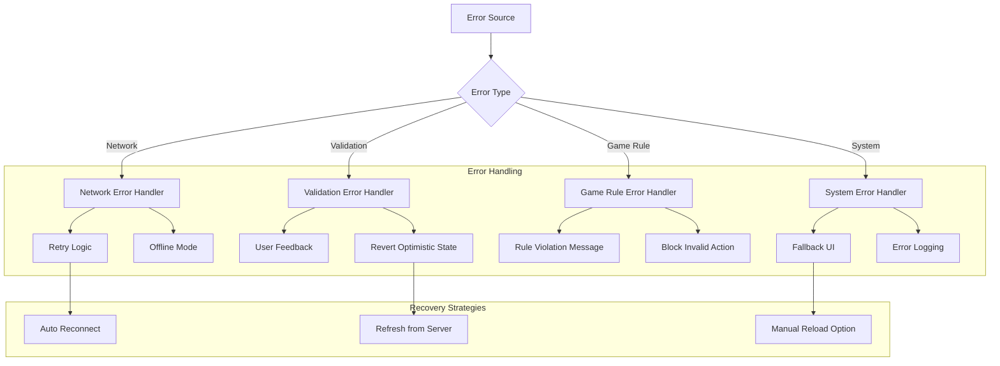

# Frontend Architecture

## React Component Hierarchy



## State Management Architecture

```mermaid
graph TB
    subgraph "React State Management"
        LocalState[Local Component State<br/>useState]
        GameState[Game State Hook<br/>useGameState]
        MessagingState[Messaging State<br/>usePlayGameMessaging]
    end
    
    subgraph "Custom Hooks"
        UseGameState[useGameState.ts]
        UseMessaging[usePlayGameMessaging.ts]
        UseSocket[useGameMessaging.ts]
        UseSound[usePlaySound.ts]
        UseApi[useApi.tsx]
    end
    
    subgraph "External State"
        CoreLogic[@codenames50/core<br/>Game Logic]
        SocketIO[Socket.IO Client<br/>Real-time Updates]
        LocalStorage[Browser Local Storage<br/>User Preferences]
    end
    
    LocalState --> UseGameState
    GameState --> UseGameState
    MessagingState --> UseMessaging
    
    UseGameState --> CoreLogic
    UseMessaging --> UseSocket
    UseSocket --> SocketIO
    UseSound --> LocalStorage
    UseApi --> SocketIO
    
    classDef state fill:#e8f5e8
    classDef hooks fill:#e1f5fe
    classDef external fill:#f3e5f5
    
    class LocalState,GameState,MessagingState state
    class UseGameState,UseMessaging,UseSocket,UseSound,UseApi hooks
    class CoreLogic,SocketIO,LocalStorage external
```

## Material-UI Integration



## Custom Hooks Deep Dive



## Game State Hook Implementation



## Messaging Hook Implementation



## Component Communication Patterns



## Responsive Design Strategy

```mermaid
graph TB
    subgraph "Breakpoint System"
        Mobile[Mobile: xs (0-599px)]
        Tablet[Tablet: sm (600-959px)]
        Desktop[Desktop: md+ (960px+)]
    end
    
    subgraph "Layout Adaptations"
        MobileLayout[Mobile Layout<br/>- Single column<br/>- Stacked components<br/>- Bottom navigation]
        TabletLayout[Tablet Layout<br/>- Two columns<br/>- Side panels<br/>- Larger touch targets]
        DesktopLayout[Desktop Layout<br/>- Multi-column<br/>- Rich interactions<br/>- Hover effects]
    end
    
    subgraph "Component Variations"
        BoardMobile[Board: 3x3 grid visible]
        BoardTablet[Board: 4x4 grid visible]
        BoardDesktop[Board: Full 5x5 grid]
        
        NavMobile[Nav: Bottom tabs]
        NavTablet[Nav: Side drawer]
        NavDesktop[Nav: Top bar]
    end
    
    Mobile --> MobileLayout
    Tablet --> TabletLayout
    Desktop --> DesktopLayout
    
    MobileLayout --> BoardMobile
    TabletLayout --> BoardTablet
    DesktopLayout --> BoardDesktop
    
    MobileLayout --> NavMobile
    TabletLayout --> NavTablet
    DesktopLayout --> NavDesktop
```

## Sound System Architecture



## Error Handling Strategy



## Performance Optimization

```mermaid
graph TB
    subgraph "React Optimizations"
        Memoization[React.memo Components]
        UseMemo[useMemo for Expensive Calculations]
        UseCallback[useCallback for Stable References]
        LazyLoading[Lazy Loading for Routes]
    end
    
    subgraph "Bundle Optimizations"
        CodeSplitting[Code Splitting]
        TreeShaking[Tree Shaking]
        AssetOptimization[Asset Optimization]
        Compression[Gzip Compression]
    end
    
    subgraph "Runtime Optimizations"
        VirtualScrolling[Virtual Scrolling (if needed)]
        DebounceActions[Debounce User Actions]
        LocalCaching[Local State Caching]
        PreloadAssets[Preload Critical Assets]
    end
    
    Performance[Frontend Performance] --> Memoization
    Performance --> CodeSplitting
    Performance --> VirtualScrolling
    
    subgraph "Monitoring"
        WebVitals[Core Web Vitals]
        BundleAnalyzer[Bundle Analyzer]
        PerformanceAPI[Performance API]
    end
```

## Key Implementation Files

### Core Components (`packages/web/src/screens/`)
- **`PlayGameScreen.tsx`** - Main game screen container
- **`CreateGameScreen.tsx`** - Game creation flow
- **`JoinGameScreen.tsx`** - Game joining interface

### Game Components (`packages/web/src/screens/PlayGame/components/`)
- **`WordsBoard.tsx`** - Main game board with word cards
- **`Teams.tsx`** - Team management and display
- **`SendHint.tsx`** - SpyMaster hint input form
- **`Header.tsx`** - Game information and controls

### Custom Hooks (`packages/web/src/utils/`)
- **`useGameState.ts`** - Game state management hook
- **`usePlayGameMessaging.ts`** - WebSocket messaging integration
- **`usePlaySound.ts`** - Sound effects management
- **`useApi.tsx`** - HTTP API communication

### Utilities (`packages/web/src/utils/`)
- **`styles.ts`** - Shared styling utilities
- **`actions.ts`** - Action helper functions
- **`types.ts`** - TypeScript type definitions

This frontend architecture provides a responsive, real-time multiplayer game interface with comprehensive state management, error handling, and performance optimization.