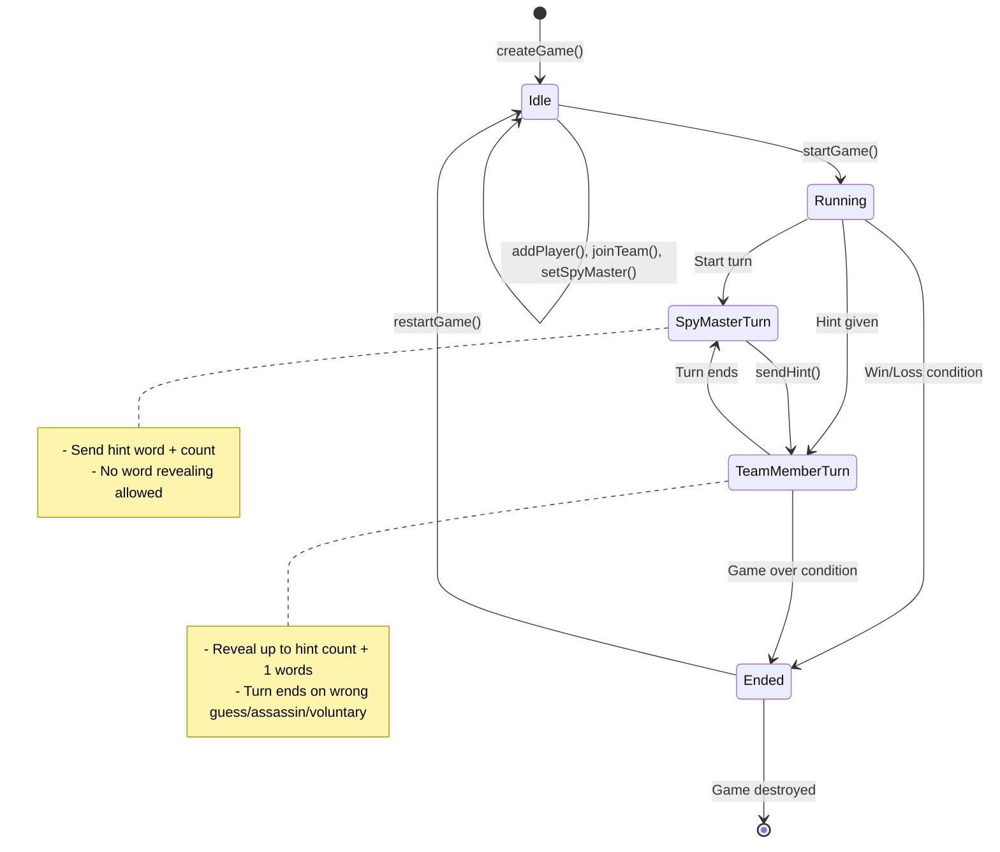
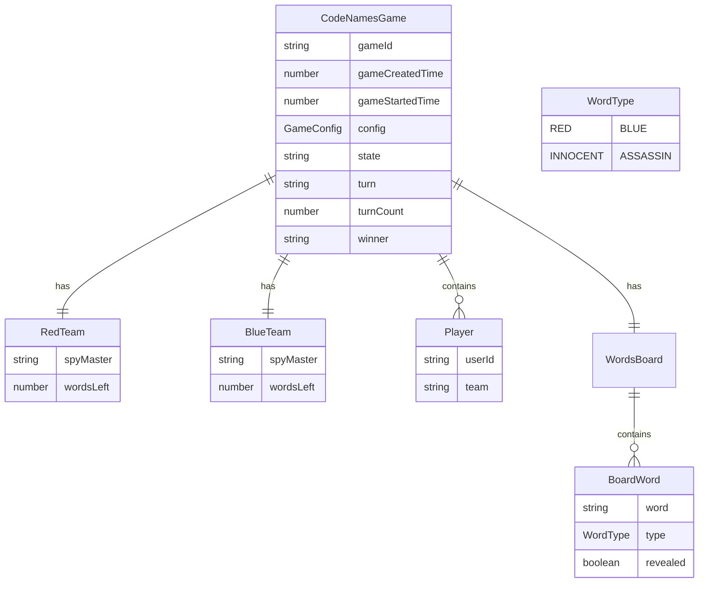
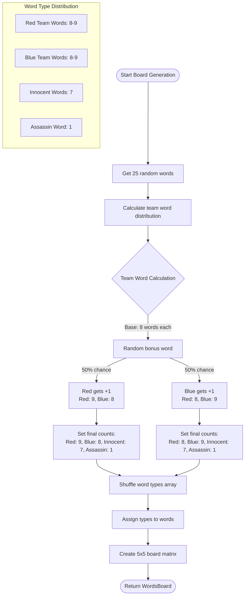
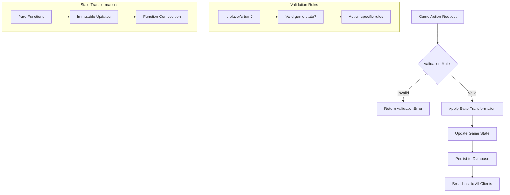
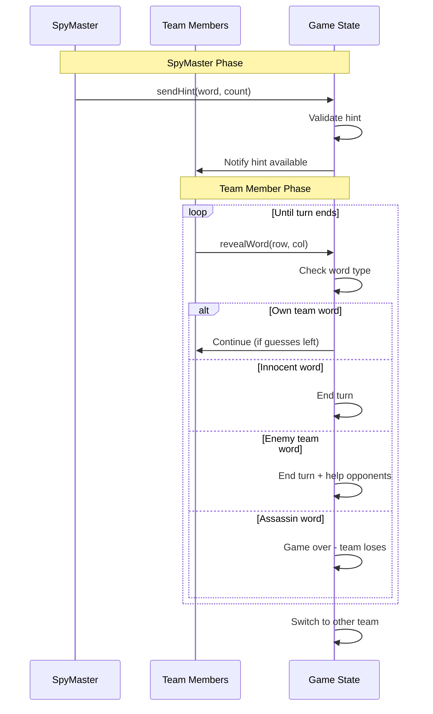
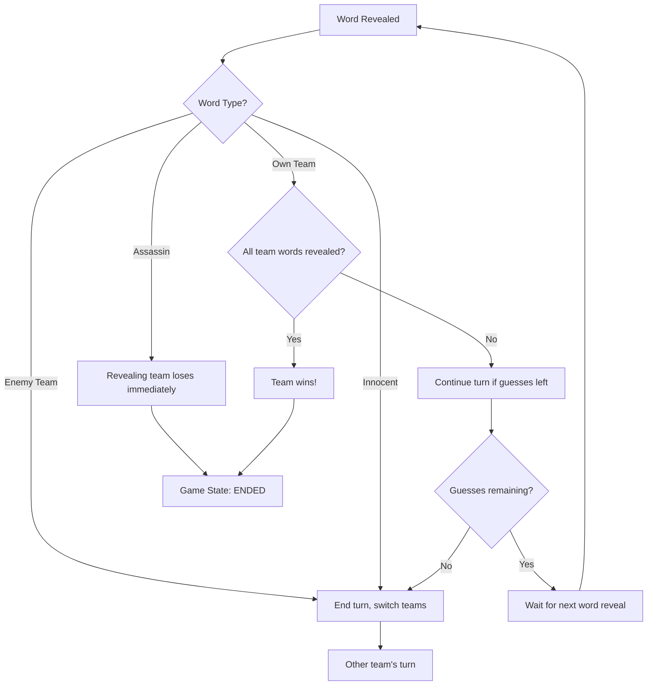
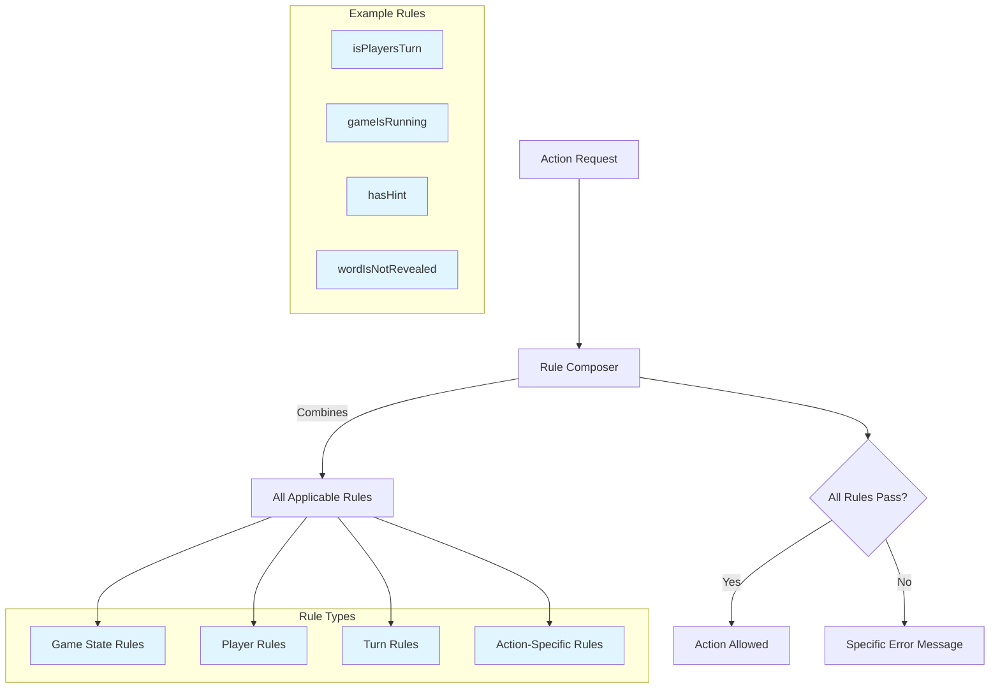
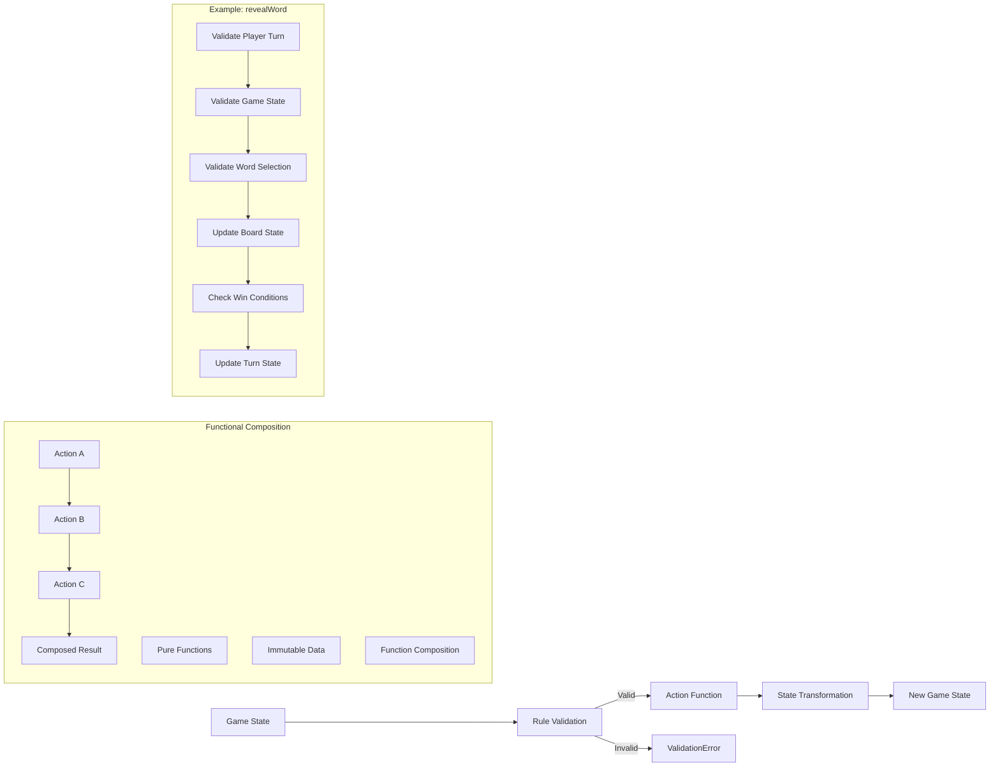
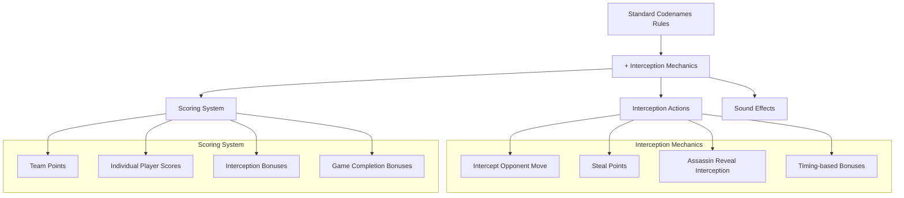

# Game Logic Deep Dive

## Game State Machine

## Core Game Models

## Board Generation Algorithm

## Game Actions Flow

## Turn Management Logic

## Win Condition Logic

## Validation System Architecture

## Core Function Composition

## Key Implementation Files

### `models.ts` - Type Definitions

- `CodeNamesGame`: Main game state interface
- `WordsBoard`: 2D array of `BoardWord` objects
- `GameStates`: Enum for game lifecycle
- `WordType`: Enum for word categories

### `actions.ts` - State Transformations

- Pure functions for all game state changes
- Ramda-based immutable updates
- Function composition for complex operations

### `rules.ts` - Validation Logic

- Composable validation functions
- Type-safe error messages
- Context-aware rule checking

### `ports.ts` - Public API

- Main entry points for game operations
- Integration between actions and rules
- Clean interface for external packages

## Game Variants

### Standard Codenames

The classic game where teams compete to identify their words first while avoiding the assassin.

### Interception Variant

A new game variant that adds interception mechanics and scoring:

#### Interception Rules

1. **Intercept Moves**: Players can intercept opponent team actions under certain conditions
2. **Score System**: Points awarded for successful interceptions and game completion
3. **Sound Feedback**: Audio cues for interception events (steal sound effect)
4. **Enhanced Strategy**: Adds tactical depth to the standard game