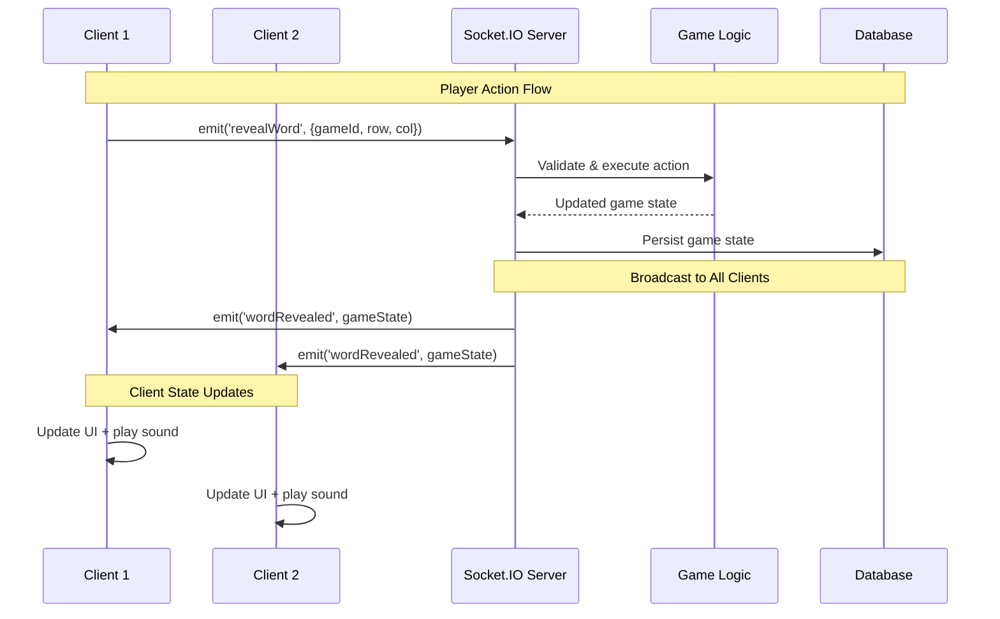
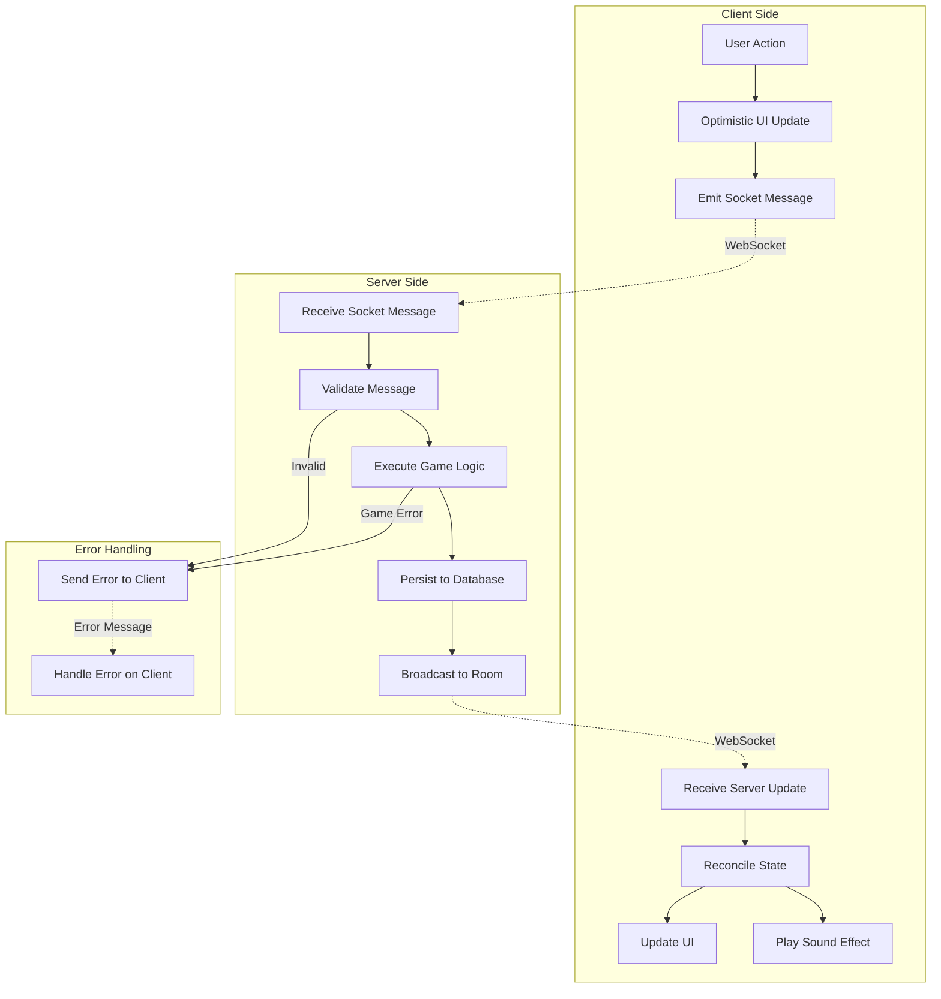
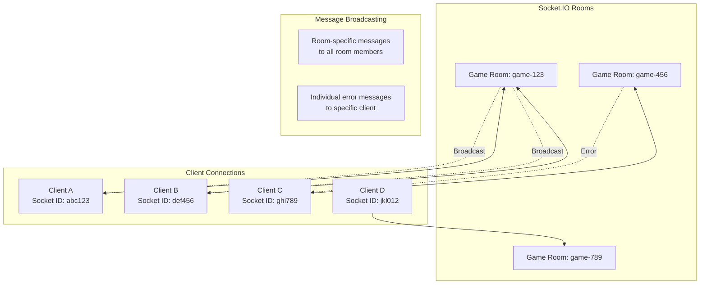
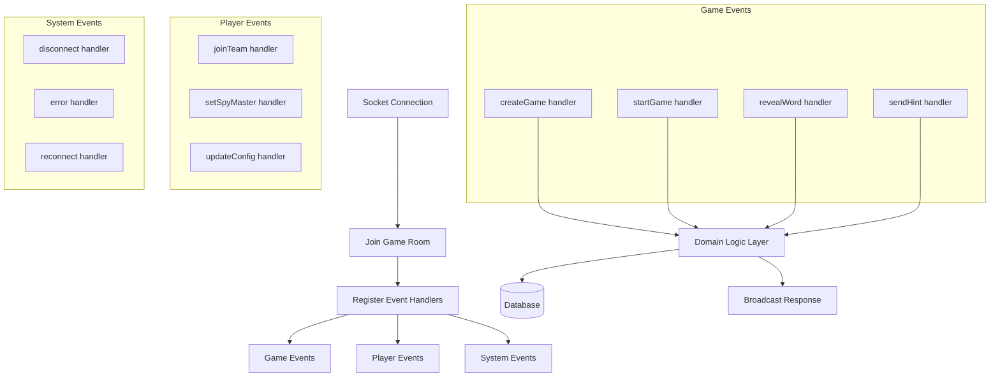
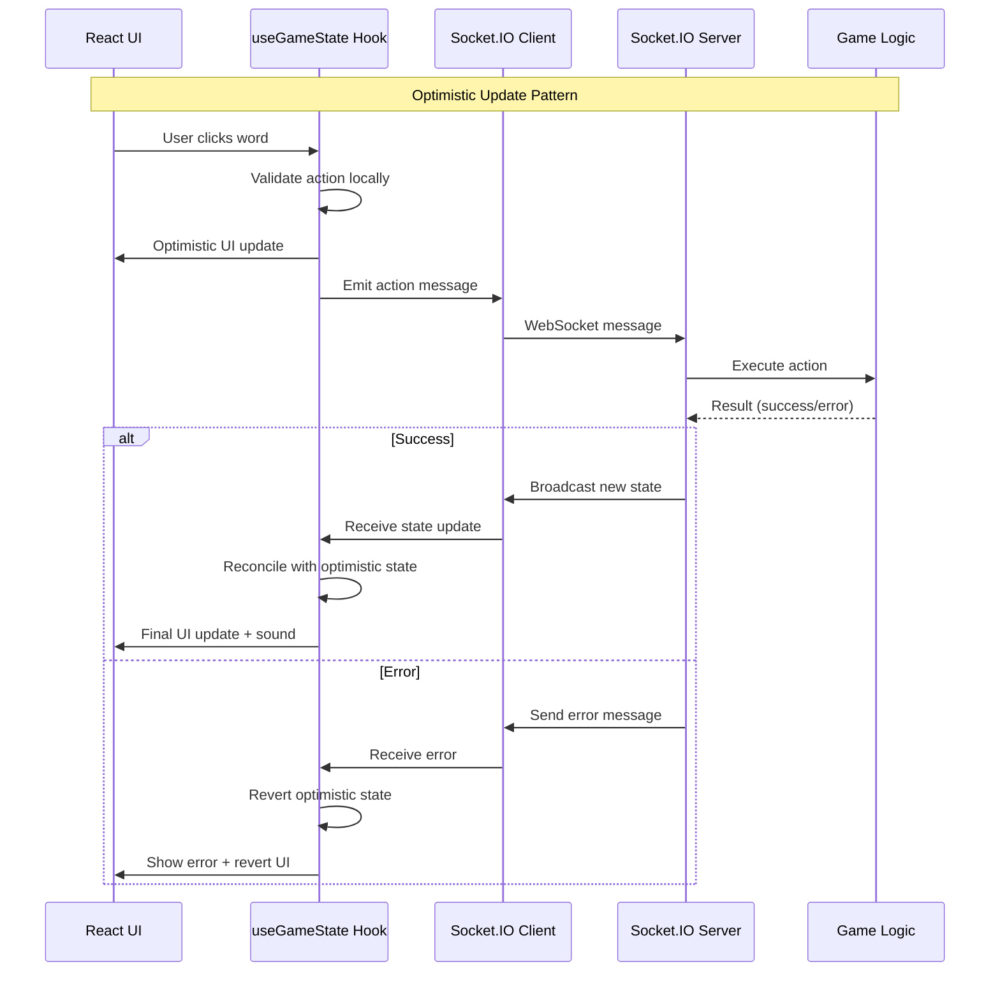
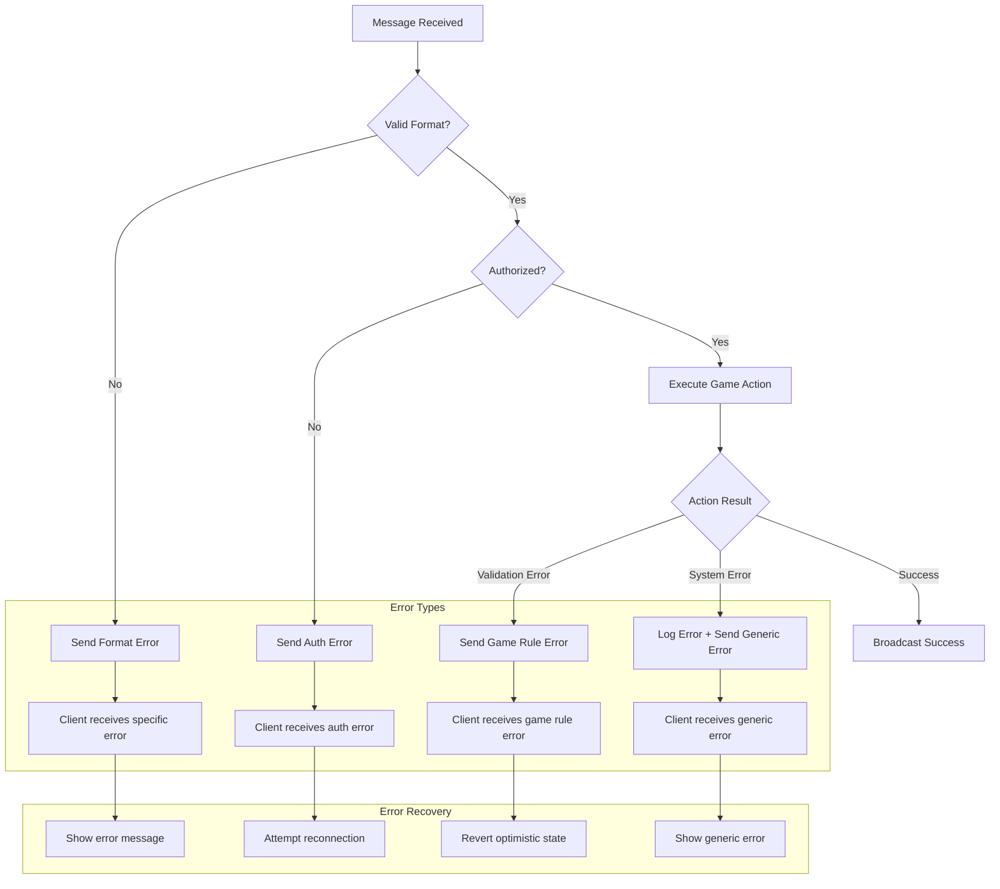
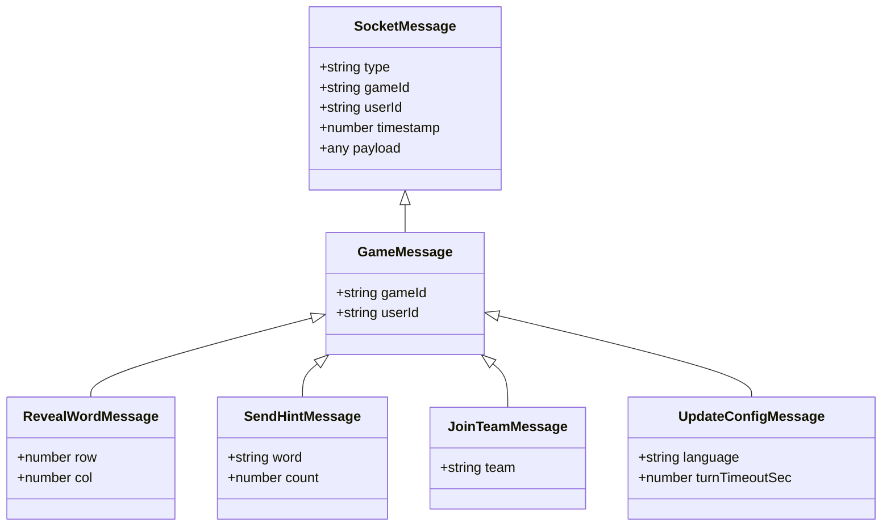
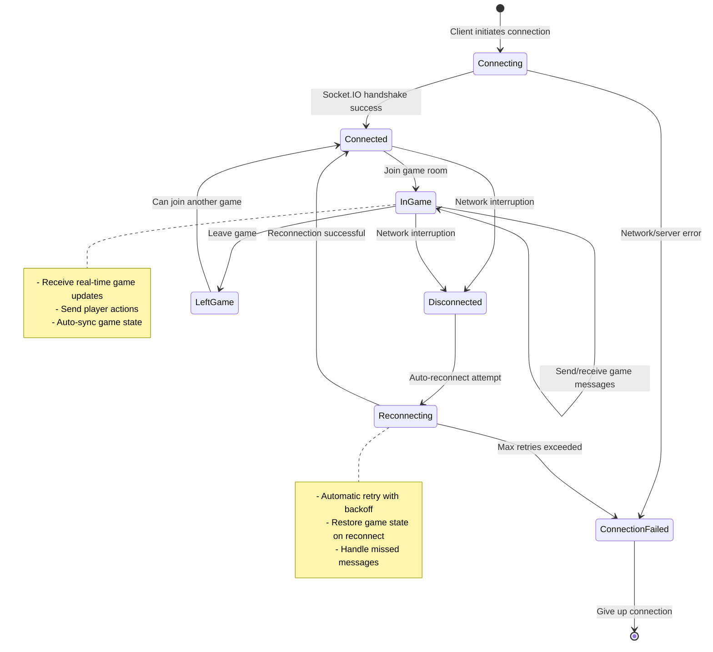

# Real-time Communication

## Socket.IO Message Flow

## Message Type Hierarchy

```mermaid
graph TB
    Messages[Socket Messages] --> GameMgmt[Game Management]
    Messages --> PlayerActions[Player Actions]
    Messages --> Gameplay[Gameplay Actions]
    Messages --> System[System Messages]
    
    GameMgmt --> CreateGame[createGame]
    GameMgmt --> JoinGame[joinGame]
    GameMgmt --> StartGame[startGame]
    GameMgmt --> RestartGame[restartGame]
    
    PlayerActions --> JoinTeam[joinTeam]
    PlayerActions --> SetSpyMaster[setSpyMaster]
    PlayerActions --> RandomizeTeam[randomizeTeam]
    PlayerActions --> UpdateConfig[updateConfig]
    
    Gameplay --> SendHint[sendHint]
    Gameplay --> RevealWord[revealWord]
    Gameplay --> ChangeTurn[changeTurn]
    
    System --> Connect[connect]
    System --> Disconnect[disconnect]
    System --> Error[error]
    System --> GameState[gameState]
    
    classDef mgmt fill:#e1f5fe
    classDef player fill:#f3e5f5
    classDef game fill:#e8f5e8
    classDef sys fill:#fff3e0
    
    class GameMgmt,CreateGame,JoinGame,StartGame,RestartGame mgmt
    class PlayerActions,JoinTeam,SetSpyMaster,RandomizeTeam,UpdateConfig player
    class Gameplay,SendHint,RevealWord,ChangeTurn game
    class System,Connect,Disconnect,Error,GameState sys
```

## Client-Server Communication Patterns

## Room Management

## WebSocket Event Handlers

## State Synchronization Strategy

## Error Handling Patterns

## Message Payload Structure

## Connection Lifecycle

## Performance Optimizations

```mermaid
graph TB
    subgraph "Client Optimizations"
        Debounce[Debounce rapid actions]
        LocalValidation[Local validation before emit]
        StateCache[Cache game state locally]
        OptimisticUI[Optimistic UI updates]
    end
    
    subgraph "Server Optimizations"
        RoomBased[Room-based broadcasting]
        MessageQueue[Message queuing]
        StateCompression[Compress large game states]
        RateLimit[Rate limiting per client]
    end
    
    subgraph "Network Optimizations"
        BinaryProtocol[Binary protocol for large data]
        Compression[Socket.IO compression]
        Heartbeat[Connection heartbeat]
        Reconnection[Smart reconnection logic]
    end
    
    Client[Client Performance] --> Debounce
    Client --> LocalValidation
    Client --> StateCache
    Client --> OptimisticUI
    
    Server[Server Performance] --> RoomBased
    Server --> MessageQueue
    Server --> StateCompression
    Server --> RateLimit
    
    Network[Network Performance] --> BinaryProtocol
    Network --> Compression
    Network --> Heartbeat
    Network --> Reconnection
```

## Key Implementation Files

### Client Side (`packages/web/src/utils/`)
- **`useGameMessaging.ts`** - Main WebSocket hook for game communication
- **`usePlayGameMessaging.ts`** - Specific messaging for gameplay actions
- **`socketMessaging.ts`** - Low-level Socket.IO wrapper utilities

### Server Side (`packages/server/src/sockets/`)
- **`handlers.ts`** - Socket.IO event handlers for all message types
- **`main.ts`** - Socket.IO server setup and room management
- **`adapters.ts`** - Integration between Socket.IO and domain logic

### Message Definitions (`packages/messaging/src/`)
- **`messages.ts`** - TypeScript interfaces for all message types
- **`index.ts`** - Exported message creation utilities

This real-time architecture ensures responsive gameplay with optimistic updates, comprehensive error handling, and efficient state synchronization across all connected clients.